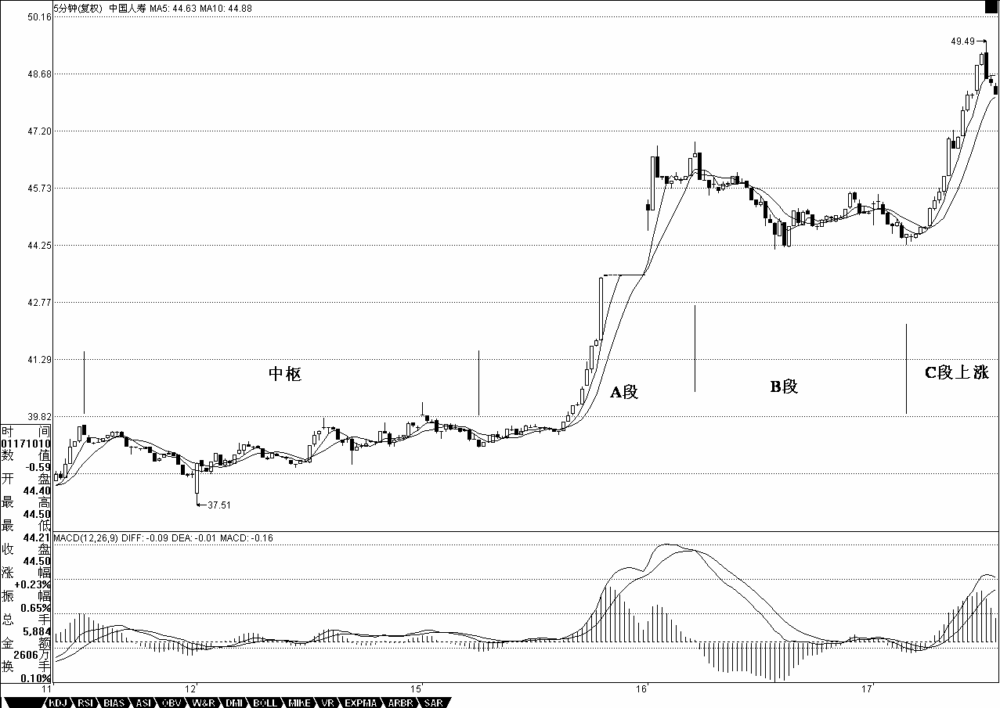
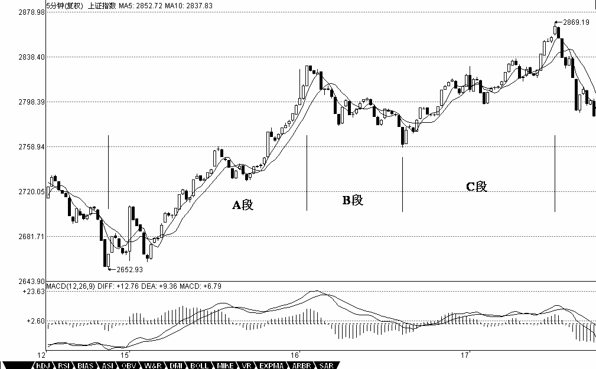
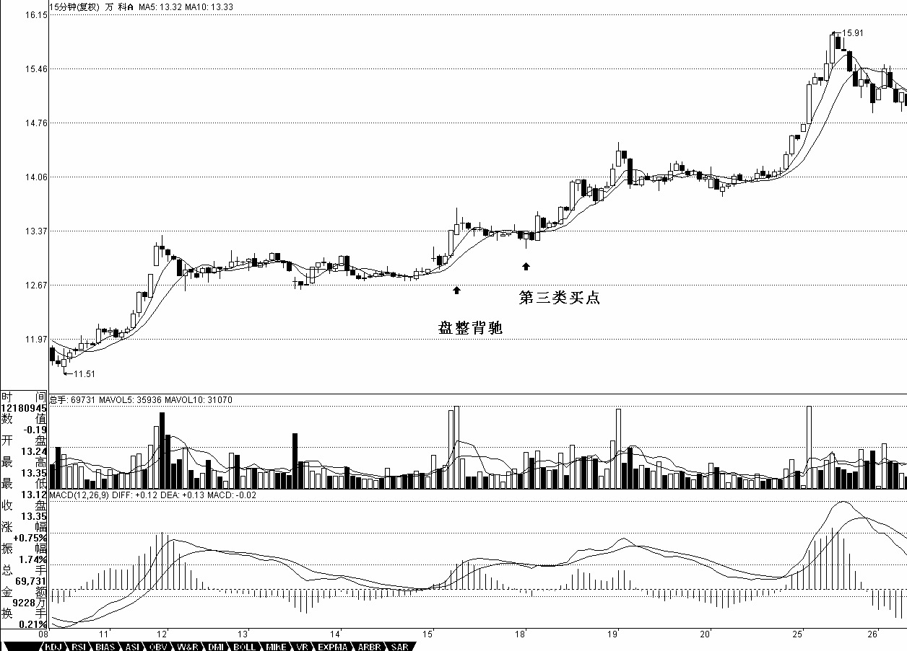

# 0436 - 教你炒股票24：MACD对背弛的辅助判断
日期：(2007-01-18 15:02:43) 分类：[时政经济（缠中说禅经济学）] 

这一章完全不在计划之中，其实该问题以前已说过，现在有点炒冷饭。但发现这里的人，绝大多数还是搞不懂，也就不妨结合点例子再说一次。要完全解决背弛问题，必须对中枢进行更进一步的分析，这是以后章节的事情了。但现在大家好象都急于用，而对中枢，好象真理解的没几个，继续深入下去，浅的都一团浆，深的更没法弄。因此，详细说说MACD对背弛的辅助判断这样一种不绝对精确，但比较方便，容易理解的方法，对那些还没把握中枢基本分析的人，是有帮助的。也就是说，如果你一时真搞不懂中枢的问题，那就用这个方法，也足以应付一般的情况了。


首先，背弛同样有级别的问题，一个1分钟级别的背弛，在绝大多数的情况下，不会制造一个周线级别的大顶，除非日线上同时也出现背弛。但出现背弛后必然有逆转，这是没任何商量余地的。有人要问，究竟逆转多少？那很简单，就是重新出现新的次级别买卖点为止。由于所有的买卖点，最终都可以归到某级别的第一类买卖点，而背驰与该种买卖点密切相关，所以可以这样说，任何的逆转，必然包含某级别的背驰，以后用严格的方法，可以证明如下定理：


缠中说禅背驰-买卖点定理：任一背驰都必然制造某级别的买卖点，任一级别的买卖点都必然源自某级别走势的背驰。


该定理的证明这理暂且不说了，换句话说，只要你看到某级别的背驰，必然意味着要有逆转。但逆转并不意味着永远的，例如，日线上向上的背驰制造一个卖点，回跌后，在5分钟或30分钟出现向下的背驰制造一个买点，然后由这买点开始，又可以重新上涨，甚至创新高，这是很正常的情况。


用MACD判断背驰，首先要有两段同向的趋势。同向趋势之间一定有一个盘整或反向趋势连接，把这三段分别称为A、B、C段。显然，B的中枢级别比A、C里的中枢级别都要大，否则A、B、C就连成一个大的趋势或大的中枢了。A段之前，一定是和B同级别或更大级别的一个中枢，而且不可能是一个和A逆向的趋势，否则这三段就会在一个大的中枢里了。


归纳上述，用MACD判断背驰的前提是，A、B、C段在一个大的趋势里，其中A之前已经有一个中枢，而B是这个大趋势的另一个中枢，这个中枢一般会把MACD的黄白线（也就是DIFF和DEA）回拉到0轴附近。而C段的走势类型完成时对应的MACD柱子面积（向上的看红柱子，向下看绿柱子）比A段对应的面积要小，这时候就构成标准的背弛。


估计有些人连MACD的最基本常识都没有，不妨说两句。首先你要打开带MACD指标的图（千万别问本ID怎么才会有MACD的图，本ID会彻底晕倒的），MACD上有黄白线，也有红绿柱子，红绿柱子交界的那条直线就是0轴。上面说的颜色都是通常系统用的，如果你的系统颜色不是这样，那本ID只能说上面两条绕来绕去的曲线就是黄白线，有时一组向上、有时一组向下的就是红绿柱。本ID也只能描述到这样地步了，如果还不明白，到任意一个证券部举个牌子，写上“谁是黄白线、谁是红绿柱”，估计会有答案的。

这样说有点抽象，就用一个例子，请看601628人寿的5分钟图：11日11点30分到15日10点35分构成一个中枢。15日10点35分到16日10点25分构成A段。16日10点25分到17日10点10分，一个标准的三段构成新的中枢，也相应构成B段，同时MACD的黄白线回拉0轴。其后就是C段的上涨，其对应的MACD红柱子面积明显小于A段的，这样的背驰简直太标准了。注意，看MACD柱子的面积不需要全出来，一般柱子伸长的力度变慢时，把已经出现的面积乘2，就可以当成是该段的面积。所以，实际操作中根本不用回跌后才发现背驰，在上涨或下跌的最后阶段，判断就出来了，一般都可以抛到最高价位和买在最低价位附近。




【编者注：此图可能是当时的网友补充的】


上面是一种最标准的背驰判断方法。那么，背驰在盘整中有用吗？首先，为明确起见，一般不特别声明的，背驰都指最标准的趋势中形成的背驰。而盘整用，利用类似背驰的判断方法，也可以有很好的效果。这种盘整中的类似背驰方法的应用，称为盘整背弛判断。


盘整中往上的情况为例子，往下的情况反之亦然。如果C段不破中枢，一旦出现MACD柱子的C段面积小于A段面积，其后必定有回跌。比较复杂的是如果C段上破中枢，但MACD柱子的面积小于A段的，这时候的原则是先出来，其后有两种情况，如果回跌不重新跌回，就在次级别的第一类买点回补，刚好这反而构成该级别的第三类买点，反之就继续该盘整。

昨天上海的5分钟图上，就构成一个标准盘整背驰。12日14点35到16日9点45构成A段，16日9点45到16日13点30构成B段，16日13点30到17日13点05构成C段。其中B段制造了MACD黄白线对0轴的回拉，C段与A段构成背驰。对C段进行更仔细的分析，9点35的第一个红柱，由于并没创新高，所以不构成背驰，10点40的第二个红柱子，由于这时候的C段还没有形成一个中枢，根据走势必完美，这C段肯定没完，所以继续。13点05分，第三个红柱子，这时候，把三个红柱子的面积加起来，也没有A段两个红柱子面积和大，显然背驰了，所以要走人了。而随后的回跌，马上跌回大的中枢之内，所以不可能有什么第三类买点，不过站在超短线的立场，如果出现次级别的第一类买点，又可以重新介入了。




【编者注：此图可能是当时的网友补充的】


那么，有没有盘整背驰后回跌形成第三类买点的例子，其实这种例子太多了，第三类买点，有一种情况就是这样构成的。例如，000002万科的15分钟图，12月15日10点45分，构成一个盘整背驰，所以要出来，其后的次级别回跌并不重新回到前面的中枢里，就在18日9点45分构成了标准的第三类买点，这时候就该重新回补了。




【编者注：此图可能是当时的网友补充的】


背驰与盘整背驰的两种情况中，背驰是最重要的，一旦出现背驰，其回跌，一定至少重新回到B段的中枢里，看看601628人寿昨天的回跌，就一目了然了。而盘整背驰，一般会在盘整中弄短差时用到，如果其间突破中枢，其回跌必须分清楚上面的两种情况。


必须注意，无论背驰与盘整背驰，只要满足上面相应的标准，其技术上都是绝对的，没有任何的或然。问题不在于这种技术的准确性，而在于操作者判断的准确性，也就是说，必须先把什么是背驰，什么是盘整背驰，他们之间的标准是什么，如果连这些都搞不清楚，那是无法熟悉应用这项技术的。

必须说明的是，由于MACD本身的局限性，要精确地判断背驰与盘整背驰，还是要从中枢本身出发，但利用MACD，对一般人理解和把握比较简单点，而这已经足够好了。光用MACD辅助判断，即使你对中枢不大清楚，只要能分清楚A、B、C三段，其准确率也应该在90%以上。而配合上中枢，那是100%绝对的，因为这可以用纯数学的推理逻辑地证明，具体的证明，以后会说到。


**本文评论获取自靠谱的方式，包含疑似禅师的回复数量：[37]**


```
UID:[0] 昵称：[匿名] 悠悠悠哉 日期：(2007-01-18 15:08:56)
哈哈 第一哦那个中和  或者 中国石化 是不是这样就是又背离？前者5分 后者30分
```


```
UID:[0] 昵称：[匿名] 悠悠悠哉 日期：(2007-01-18 15:11:29)
那个中和是不是5分的调整要结束了  日线上看 是不是第3买点出现了？还有中国石化，看30图，是不是有背离了，再来一拨杀跌，短期会见底吗？
```


```
UID:[1215172700] 昵称：缠中说禅 日期：(2007-01-18 15:13:08)
今天的大盘没什么可说的，工行的破位是为了去完成第三段的走势，所以很正常，当该走势完成后，将出现周线级别中枢的第二段走势。个股方面，还是中、低价股票。什么药呀、酒呀就不说了，农业、环保、汽车、科技等等，都会有表现的。注意，中国最多的是人，只要和人口多有关的东西，都会被弄的，像酒一样。目前之下，个股比指数重要得多。
```


```
UID:[1215172700] 昵称：缠中说禅 日期：(2007-01-18 15:14:46)
	[匿名] 悠悠悠哉  2007-01-18 15:08:56 
	哈哈 第一哦那个中和 或者 中国石化 是不是这样就是又背离？前者5分 后者30分  
==
先学习，光知道答案有什么用？最好是自己分析出来。以后光问没自己分析的，本ID一般都不准备回答了。你自己分析，本ID告诉你分析的对错，这样才能提高。
```


```
UID:[1215172700] 昵称：缠中说禅 日期：(2007-01-18 15:18:07)
	[匿名] 新年好  2007-01-18 15:12:26 
	今天好早啊。缠姐好啊  
==
等一下要出去一下，有人过来找本ID去收一个镍矿，本ID没多大兴趣，不过可以听听。晚上才能上来了。
```


```
UID:[1215172700] 昵称：缠中说禅 日期：(2007-01-18 15:24:54)
	[匿名] 新年好  2007-01-18 15:19:23 
	缠姐，600900长江电力5分钟线上，按我的分析，1月18号11点就产生背驰了，以后的走势应该发生逆转，可现在看来并没有啊。我哪里分析错了吗？  
==
先将上面的课程好好研究透了再分析，看看是否符合背驰再说。
```


```
UID:[1215172700] 昵称：缠中说禅 日期：(2007-01-18 15:28:34)
	[匿名] 惊为天人  2007-01-18 15:18:31 
	缠主你好，能否能用“没有趋势没有背驰”的理论，来解说一下昨天大盘和人寿的背驰，麻烦尽量写实，如果用很精练抽象的语言一带而过的话，相信有好多和我一样没有悟性的同学还是会很糊涂。用的均线是哪种是5MA和10MA的吗？macd指标参数是多少？趋势的分段时间点，背驰的时间，这样明确才能让我等菜鸟细细体会！谢谢啦!  
===
你先把本帖看清楚，把三个例子研究清楚。和什么均线都没有关系，说的是MACD。对MACD的一些最基础知识，这里就不用说了。不知道的，随便在证券部抓个人都可以问到。
```


```
UID:[1215172700] 昵称：缠中说禅 日期：(2007-01-18 15:31:05)
各位好好研究图形，把细节研究透了，一晚时间怎么都够了。然后再多看图，用自己理解的去分析，看能不能把握，这样才有提高的。本ID要去镍矿一下了，晚上再上来。再见。
```


```
UID:[0] 昵称：[匿名] 过客 日期：(2007-01-18 15:33:54)
报道，禅姐！
```


```
UID:[0] 昵称：[匿名] 悠悠悠哉 日期：(2007-01-18 15:35:16)
是自己分析的啊我昨天研究了下 macd 今天拿来用用 看看对不对啊到底我分析的对不对啊？？
呵呵 上文仔细看了 好像是对我这样的在进行扫盲 多谢老大啊！
```


```
UID:[1215172700] 昵称：缠中说禅 日期：(2007-01-18 20:53:23)
	[匿名] 恒旧常新  2007-01-18 20:40:14 
	请问博主:
	面积是时间长度乘以红绿柱中最大值吗?  
===
有些事情没必要弄得那么复杂。两片柱子堆成的面积，面积大小，肉眼就可以看到，还用计算？如果真计算，复习一个微积分里的公式就知道了。
```


```
UID:[1215172700] 昵称：缠中说禅 日期：(2007-01-18 20:57:17)
	[匿名] KK  2007-01-18 20:42:07 
	对于上海指数那一个，
	＝＝＝＝＝＝＝＝1
		0点40的第二个红柱子，由于这时候的C段还没有形成一个中枢，根据走势必完美，这C段肯定没完，所以继续。13点05分，第三个红柱子，这时候，把三个红柱子的面积加起来，也没有A段两个红柱子面积和大，显然背驰了，所以要走人了
	＝＝＝＝＝＝＝＝
	到第二个红柱子为什么没形成中枢？到次级别图上看已经有三个走势重叠了啊  

===
你首先要搞清楚中枢形成的三段的方向是怎么开始的，不是随便三段就是的。这是最基础的东西，不能到现在还搞不清楚。如果是向上的走势，里面的中枢一定是下-上-下的，向下的相反。
```


```
UID:[1215172700] 昵称：缠中说禅 日期：(2007-01-18 21:05:25)
	[匿名] nn  2007-01-18 20:15:39 
	楼主好人啊!今天讲的课似乎有点明白了,但实际去看图又有问题了,发现许多股票下跌时看不出有背弛,请问楼主:
	是否因突发消息导致的急跌就没有背驰出现呢?如这次地产股,谢啦!  
===
谁告诉你没有的？每只都有。万科就不用说了，前面已经分析过。000042是不是地产股票，它的60分钟图上看不出背驰？000046、000006等等，哪个看不出？要好好研究，不要随便下结论，这样没法提高。
```


```
UID:[1215172700] 昵称：缠中说禅 日期：(2007-01-18 21:15:02)
	[匿名] 笨笨猪  2007-01-18 21:03:47 
	对前面问招商地产的问题，我也有点疑惑。请博主鉴定吧  
===
1分钟图上，4日13点，一个标准的背驰在31。2元的位置上。
知道为什么一个1分钟图上的背驰就有如此的杀伤力吗？
因为一个快速赶顶的股票，最后段的上升往往就是一分钟上的趋势的延伸，这时候，一旦出现背驰，就会急促下跌到延伸的启动位置。
看背驰，一定要结合趋势来看。特别在快速的市场变动节奏中，往往一个很低级别的背驰就造成很快速的下跌，因为是和上涨同样快速和幅度大的。
```


```
UID:[1215172700] 昵称：缠中说禅 日期：(2007-01-18 21:16:32)
	[匿名] abc  2007-01-18 21:13:22 
		10点40的第二个红柱子，由于这时候的C段还没有形成一个中枢，根据走势必完美，这C段肯定没完，所以继续。
	==========
	从16.13.30~17.10.40已经完成了上，下，上三段，LZ为什么说C段还没有完成？  

===
怎么到今天还有这么多人连中枢的三段方向是怎么样都搞不清楚？C段是一个向上的过程，里面的小中枢，怎么可能是上、下、上方向的？
```


```
UID:[1215172700] 昵称：缠中说禅 日期：(2007-01-18 21:30:38)
	[匿名] 无知  2007-01-18 21:10:29 
	缠姐，有两个问题求教！
	1.000682昨天下午收盘候发现macd回抽0轴后红炷显著缩小，早上集合竟价出掉了。不过今天好象没怎么下跌。不知这个背驰判断是否正确，卖得早了吗？
===
先把趋势搞清楚，该股日线上在干什么？30分钟在干什么？才轮到5分钟的问题。如果30分钟或日线在一个明确的上涨初期时，那5分钟的背驰当然不可能制造太大的回挡。对于3元多的一个上涨初期的股票，一个5分钟的背驰，让他从3。48元回到3。35元，4%的幅度，已经足够了，没人告诉说5分钟背驰就一定要跌50%的。人寿之所以跌得那么多，就是因为背驰前的5分钟是一个快速的急拉，因此对称着跌下来了。而000682不存在这种情况。

	2.国寿今天的下跌是否背驰构成了5分钟级别的第一类买点？还是属于一分钟的背驰？因为5分钟没有两段可以对比的下跌趋势！  
==
1分钟有，然后就从41。0反弹到44。2，足够可以了。
```


```
UID:[1215172700] 昵称：缠中说禅 日期：(2007-01-18 21:36:20)
	[匿名] 赚到了  2007-01-18 21:30:56 
	缠MM,问个极端的问题,比如背驰出现时,有个傻庄故意强拉,这样随后的走势就不会逆转,这样的图形用你的理论应该怎么解释呢?  
===
庄家的运转不也在构成走势本身？别把庄家当上帝一样。如果他可以拉抬，自然就不会出现背驰；如果他边拉边出，走势上自然留下痕迹，就是背驰。注意，走势一切力量的综合结果，没必要单独考虑某种力量。
```


```
UID:[1215172700] 昵称：缠中说禅 日期：(2007-01-18 21:42:39)
	[匿名] KK  2007-01-18 21:34:31 
	===========
		你首先要搞清楚中枢形成的三段的方向是怎么开始的，不是随便三段就是的。这是最基础的东西，不能到现在还搞不清楚。如果是向上的走势，里面的中枢一定是下-上-下的，向下的相反。
	============
	又重新翻了前面缠中说禅走势中枢的定义：某级别走势类型中，被至少三个连续次级别走势类型所重叠的部分，称为缠中说禅走势中枢。还是犯糊涂，这个下－上－下包含了两个中枢么？ 
	这是一个上涨的趋势， 一定包含至少两个中枢，是不是“下上”的水平区间， 然后后面的“上下”水平区间正好构成两个中枢？ 
	
===
好好把上面的补一下，一个趋势，有两个中枢，因此至少就有6段走势，然后加上前面低部回拉的第一段，最后冲刺的一段，还有连接两个中枢的一段，至少有9段走势是明确无误的。要多看图，否则怎么会有感觉，人寿5分钟图上，从11日9点55到17日13点05，就是一个最标准的没有出现延伸的完整上涨，自己数数看究竟有多少段？
```


```
UID:[0] 昵称：[匿名] 悠悠悠哉 日期：(2007-01-18 21:42:52)
600661 日线图是不是出现盘整背驰啊？
```


```
UID:[1215172700] 昵称：缠中说禅 日期：(2007-01-18 21:45:15)
	[匿名] 无言  2007-01-18 21:41:51 
	缠姐,你看错了,我说的是600832日线和周线出现第三买点.另外,今天看了你的新文章,600028中午进去的是5分钟级别的第一买点,根据走势必完美的原则,明天上午还有一次回调,对吗?  
==
看错什么？本ID回答的是谁的问题？000682是你问的吗？
```


```
UID:[1215172700] 昵称：缠中说禅 日期：(2007-01-18 21:47:41)
	[匿名] 无知  2007-01-18 21:45:00 
		缠中说禅 2007-01-18 21:30:38 
			[匿名] 无知 2007-01-18 21:10:29 
			缠姐，有两个问题求教！
			1.000682昨天下午收盘候发现macd回抽0轴后红炷显著缩小，早上集合竟价出掉了。不过今天好象没怎么下跌。不知这个背驰判断是否正确，卖得早了吗？
		===
		先把趋势搞清楚，该股日线上在干什么？30分钟在干什么？才轮到5分钟的问题。如果30分钟或日线在一个明确的上涨初期时，那5分钟的背驰当然不可能制造太大的回挡。对于3元多的一个上涨初期的股票，一个5分钟的背驰，让他从3。48元回到3。35元，4%的幅度，已经足够了，没人告诉说5分钟背驰就一定要跌50%的。人寿之所以跌得那么多，就是因为背驰前的5分钟是一个快速的急拉，因此对称着跌下来了。而000682不存在这种情况。 
	
	＝＝＝＝
	象这种情况就不该卖了吗？卖了找不到买点接回啊。看来要学的还有很多啊！  
	
===
可以卖，为什么不可以？卖了知道回补就可以，这叫打短差。如果是超级短线的，用1分钟图，卖了，5分钟后就可以回补，当然前提是T+0而且又重新出现买点。
```


```
UID:[0] 昵称：[匿名] 悠悠悠哉 日期：(2007-01-18 22:10:00)
还有 那个新菜鸟说的我也有兴趣我也常常是扔了就涨 买了就跌的那种  艾！！！
```


```
UID:[1215172700] 昵称：缠中说禅 日期：(2007-01-18 22:11:08)
	2007-01-18 21:45:15 
	[匿名] 无言 2007-01-18 21:41:51 
	缠姐,你看错了,我说的是600832日线和周线出现第三买点.另外,今天看了你的新文章,600028中午进去的是5分钟级别的第一买点,根据走势必完美的原则,明天上午还有一次回调,对吗?  

==
600832的走势比较复杂，12月8日是一个日线的第三类买点。一般这种买点出现后，肯定会回升，但并不一定就能形成趋势上涨，还可能演化成复杂的中枢扩张，该股就属于后者。因此站在大的角度看，该股现在已经逐步在摆脱这巨大的周线中枢延伸。1月17日，是一个三段30分钟回拉的日线第三类买点。注意，第三类买点的结束位置不一定是整个回拉的最低位置。因为一个三段回来，C段并不一定创新低。在复杂的回拉中，还有三角形5段回拉的，只要最后一次回拉不回到原来的中枢就可以了。
```


```
UID:[1215172700] 昵称：缠中说禅 日期：(2007-01-18 22:14:31)
	[匿名] 勇敢的心  2007-01-18 21:48:42 
	缠主:
	是否当时没创出新高就不叫背驰，因为还不成趋势？  
===
创出新高也不一定是趋势，要把概念明确区分。所以还有盘整背弛判断
```


```
UID:[1215172700] 昵称：缠中说禅 日期：(2007-01-18 22:20:10)
	[匿名] 勇敢的心  2007-01-18 21:45:51 
	请问缠主：
	今天我在11：20看出60198的5分钟背驰，所以下午17.6卖掉600198对吗？  
==
5分钟没有什么背驰，1分钟还勉强有，为什么说勉强？因为现在只能看到最低一分钟的，而今天该股一开盘瞬间有一个18元以上的高价，要反映这种走势，必须有1秒种的图才能精确反映。由于交易所不提供这种图，所以在一些超级快速的走势中，1分钟图上都会有点变异，这不是理论的问题，而是交易所不能提供最详尽数据的问题。一般来说，最精确的、最低级别的图，就是每一笔成交按次序排列而成的图，现在看的1分钟图，已经有点粗糙了。但对于大一点的走势来说，影响不大。
```


```
UID:[1215172700] 昵称：缠中说禅 日期：(2007-01-18 22:23:32)
	[匿名] 大风  2007-01-18 22:19:57 
	老师问一个问题只看日线图不可以吗？
	如果可以，那怎么理解缠中说禅走势中枢：某级别走势类型中，被至少三个连续次级别走势类型所重叠的部分。次级别在日线上不就是30分钟图吗？
	回答一下呀老师，虽然问题有点幼稚，但我真地想知道哎```````````````````````````````````就是不理你，你把我咋的，痛苦  

===
当然可以，但前提是你永远不打短差，而且只弄特大型的行情，也就是只弄大牛市，从底部一直拿到顶部。而对于中线调整来说，因为很多判断必须用到次级别的走势，甚至次次级别的走势。对于一些快速的走势，例如这两天的房地产，如果不看5分钟或30分钟的图，根本就看不到其中的变盘预告。
```


```
UID:[1215172700] 昵称：缠中说禅 日期：(2007-01-18 22:25:07)
	甘棠  2007-01-18 22:20:33 
	000989日线10月23日起应该是很明显的背驰，三角形一个比一个小，对吗？  
===
三角形，没有新高，怎么会有背驰？先把概念搞清楚。
```


```
UID:[1215172700] 昵称：缠中说禅 日期：(2007-01-18 22:29:11)
	[匿名] 咕咚  2007-01-18 22:15:21 
	新天国际5分钟线
	1、1月16日09：35至17日9：55构成A段前的一个中枢；
	2、1月17日9：55至17日13：00构成上升A段；
	3、1月17日13：00至18日10：15构成中枢，是B段；
	4、1月18日10：15至18日10：45构成C段；
	5、C段对比A段出现背驰，在7.8元左右；但后面并没有出现大幅下跌，反而在收盘前涨停。
	我的以上分析一定那里出了问题，我推测是B段的中枢走得不明显。不知是否是这样？这种情况如何防止？
	________________________
	1月17-18日的5分钟走势的高低点相互切入,因此只能算中枢的扩展走势,并没有形成背离?缠姐对吗?  
===
首先把背驰与盘整式背驰搞清楚。然后把上面文章中关于万科第三类买点的情况看清楚。
```


```
UID:[0] 昵称：[匿名] 悠悠悠哉 日期：(2007-01-18 22:35:18)
11.17～01.5   600661   是不是在macd上现实背驰啊？日线上看  三角形走势有待突破   目前的背驰是不是突破的信号啊？还有 有没有什么股市黑名单啊？
```


```
UID:[1215172700] 昵称：缠中说禅 日期：(2007-01-18 22:40:17)
各位一定要先分清楚趋势和盘整，然后再搞清楚背驰与盘整背驰。盘整背驰里的三种情况，特别是形成第三类买点的情况，一定要搞清楚。注意，盘整背驰出来，并不一定都要大幅下跌，否则怎么会有第三类买点构成的情况。而趋势中产生的背驰，一定至少回跌到B段中，这就可以预先知道至少的跌幅。此外，对背驰的回跌力度，和级别很有关系，如果日线上在上涨的中段刚开始的时候，MACD刚创新高，红柱子伸长力度强劲，这时候5分钟即使出现背驰，其下跌力度显然有限，所以只能打点短差，甚至可以不管。而在日线走势的最后阶段，特别是上涨的延伸阶段，一个1分钟的背驰足以引发暴跌，所以这一点必须多级别地综合来考察，绝对不能一看背驰就抛等跌50%，世界上哪里有这样的事情。好了，各位好好研究，先把一些最基础的东西搞清楚。先下，再见。
```


```
UID:[0] 昵称：[匿名] 悠悠悠哉 日期：(2007-01-18 22:47:43)
等了半天  .......都是我自己分析的啊 虽然我前天连0轴是什么都不知道 是因为我不看技术分析的以前现在研究过了 希望老大帮忙理解和应用  多谢了
```


```
UID:[0] 昵称：[匿名] 过客 日期：(2007-01-18 22:57:23)
	[匿名] KK  2007-01-18 22:41:09 
	太抽象了，彻底蒙了， 前面说的中枢，是三段的重叠， 怎么样就算一段啊？
	前面举的600497驰宏锌锗， 2005年7月27日到10月25日构成上涨， 我数了一下总共只有5段啊， 不是说上涨至少9段么？这个段是怎么分的？  

-
这个很简单的。中枢里的都是次级别的，连接中枢的也只能是次级别的，中枢有三个次级别，趋势至少有两个中枢，那就有六个，连接两个中枢的又一个，就七个，然后第一个中枢的前面见底回升的一个，第二个中枢最后上冲的一个，那就是9个了。
```


```
UID:[0] 昵称：[匿名] 过客 日期：(2007-01-18 23:00:04)
	[匿名] 勇敢的心  2007-01-18 22:38:16 
		缠中说禅
		好好把上面的补一下，一个趋势，有两个中枢，因此至少就有6段走势，然后加上前面低部回拉的第一段，最后冲刺的一段，还有连接两个中枢的一段，至少有9段走势是明确无误的。要多看图，否则怎么会有感觉，人寿5分钟图上，从11日9点55到17日13点05，就是一个最标准的没有出现延伸的完整上涨，自己数数看究竟有多少段？
	＝＝＝＝＝＝
	对于一个上涨的趋势， 至少有两个"下－上－下”构成，连同一开始那个“上”， 中间连接那个“上”，连同后面那个“上”，总共9段， 这样理解还有问题么？

	--
	请问缠主是这么划分么？  

-
我也是这样理解的，楼主的意思应该就是这样
```


```
UID:[0] 昵称：[匿名] 过客 日期：(2007-01-18 23:03:35)
	[匿名] 新菜鸟  2007-01-18 21:52:30 
	缠姑娘：
	看了您的回复心理踏实多了，今天中石化一路下跌，俺就没有前两天慌了，一直盯着盘面看机会，后来到了又是上午快收盘的时候5分钟又出现了背驰是第一买点吧？俺准备补仓，可是为了稳妥俺想用钱龙软件上的“焰”的那个功能在看看筹码分布，可是不想软件就关闭了，然后就很久连接不了，后来好不容易在收盘的时候才又连接上（在此期间我杀毒，也没有病毒啊），看其他股票的“焰”的功能时都可以，唯独是中石化不行（我刚进股市3个月，晕买晕卖，交易次数极多，估计交易费比挣的几千块钱还多。现在只有中石化一只股票，对我来说还是蛮算重仓的）。我突然想起在天涯看到过一个叫紫砚斋的网友写的股市散户黑名单的事情，不禁吓出一身冷汗。姑娘见多试广，不知道有没有这回事啊，迷茫中。另：收盘后看到中石化30分钟也出现背驰了，好像也是日线的第三类买点对吗？明天是否可以补点仓？后边我理解的是要到10元左右，不知对不对。望您能在百忙当中抽空解答一下我心中的疑惑，谢新菜鸟 （在线等您）

---
应该跌不深了反弹很快有。
```


```
UID:[0] 昵称：[匿名] Q 日期：(2007-01-19 09:00:53)
QIANG
```


```
UID:[0] 昵称：[匿名] 罗锅 日期：(2007-01-19 11:34:33)
数学妹妹！！！！！！！！！！！！！！！！！！！！！！！！！！！是不是三角形走完呀突破呀！！！！！！！！！！！！！！！！！！！！！！！！！！！！！！！！！！！！！！！！！！！！！！！！！
```


```
UID:[0] 昵称：[匿名] 罗锅 日期：(2007-01-19 13:16:51)
	[匿名] 赚到了 2007-01-19 13:06:10 
		[匿名] 654sdf 2007-01-19 12:27:20 
			[匿名] 赚到了
		====
		而一旦趋势要发生反转，必定会导致背弛这一技术信号的发出趋势反转导致背弛，而背弛同时反映了趋势反转所以庄家猛抬猛压，必然导致相应的背弛信号的发生而背弛信号的出现，也就会形成买点卖点 
	----------------
	如果真的如我所说的那种情况,那么背驰就不会发生.但是由于根据背驰判断不能等整个趋势都走完,要打提前量,因此即使是缠MM,也是有可能看错背驰的.但是我说的情况属于比较特殊的,不会经常碰到.因此还是可以根据背驰进行操作的.   
	
BBBBBBBBBBBB
谁告诉你背驰要打提前量的？？？？？？？？？？？？？？？？？？？？？？？？？？？？？？？？？？？？？？？？？？？？？？？？？？
```


