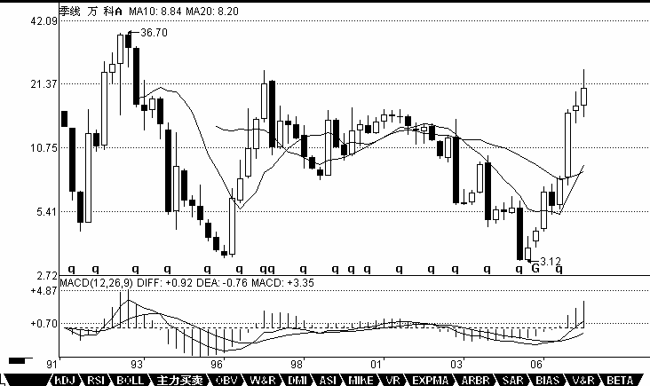

# 0449 - 教你炒股票27： 盘整背驰与历史性底部
日期：(2007-02-02 15:11:27) 分类：[时政经济（缠中说禅经济学）] 

趋势，一定有至少两个同级别中枢，对于背驰来说，肯定不会发生在第一个中枢之后，肯定是至少是第二个中枢之后，对于那种延伸的趋势来说，很有可能在发生第100个中枢以后才背驰，当然，这种情况，一般来说，一百年见不到几次。第二个中枢后就产生背驰的情况，一般占了绝大多数的情况，特别在日线以上的级别，这种就几乎达到90%以上，因此，如果一个日线以上级别的第二个中枢，就要密切注意背驰的出现。而在小级别中，例如1分钟的情况下，这种比例要小一点，但也是占大多数。一般4、5个中枢以后才出现背驰的，都相当罕见了。

 

如果在第一个中枢就出现背驰，那不会是真正意义上的背驰，只能算是盘整背驰，其真正的技术含义，其实就是一个企图脱离中枢的运动，由于力度有限，被阻止而出现回到中枢里。一般来说，小级别的盘整背驰，意义都不太大，而且必须结合其位置，如果是高位，那风险就更大了，往往是刀口舔血的活动。但如果是低位，那意义就不同了，因为多数的第二、三类买点，其实都是由盘整背驰构成的，而第一类买点，多数由趋势的背驰构成。一般来说，第二、三类的买点，都有一个三段的走势，第三段往往都破点第一段的极限位置，从而形成盘整背驰，注意，这里是把第一、三段看成两个走势类型之间的比较，这和趋势背驰里的情况有点不同，这两个走势类型是否一定是趋势，都问题不大，两个盘整在盘整背驰中也是可以比较力度的。这里，先补充一个定义，就是在某级别的某类型走势，如果构成背驰或盘整背驰，就把这段走势类型称为某级别的背驰段。

 

盘整背驰最有用的，就是用在大级别上，特别是至少周线级别以上的，这种盘整背驰所发现的，往往就是历史性的大底部。配合MACD，这种背驰是很容易判断的。这种例子太多，例如000002，谁都知道该股是大牛股，但这牛股的底部，如果学了本ID的理论，是谁都可以发现的。请看该股的季线图，也就是三个月当成一个K线的图。1993年第一季度的36。7元下跌到1996年的第一季度的3。2元，构成第一段，刚好前后13季度，一个神奇数字；1996年的第一季度然后到2001年第三季度的15。99元，构成第二段，一个典型的三角形，中枢的第二段出现三角形的情况很常见，前后23季度，和21的神气数字相差不大；2001年第三季度下跌到2005年的第三季度的3。12元，前后刚好17周，神奇数字34的一半，也是一个重要的数字。第一段跌幅是33.5元，第三段是12.87元，分别与神奇数字34和13极为接近。因为13的下一个神气数字是21，加上前面说过的17，都不可能是第三段的跌幅，因此，站在这种角度，万科的2.99元附近就是铁底了。不过这种数字分析意义不大，最简单的判断还可以用MACD来，第三段跌破第一段的3.2元，但MACD明显出现标准的背弛形态：回抽0轴的黄白线再次下跌不创新低，而且柱子的面积是明显小于第1段的，一般来说，只要其中一个符合就可以是一个背弛的信号，两个都满足就更标准了。从季度图就可以看出，万科跌破3.2元就发出背弛的信号。而实际操作中，光看季度线是不可能找到精确的买点的，但对大资金，这已经足够了，因为大资金的建仓本来就是可以越跌越买，只要知道其后是一个季度级别的行情就可以了。而对于小资金来说，这太浪费时间，因此精确的买点可以继续从月线、周线、日线、甚至30分钟一直找下去，如果你的技术过关，你甚至可以现场指出，就在这1分钟，万科见到历史性大底部。因为季度线跌破3.2元后，这个背驰的成立已经是确认了，而第三段的走势，从月线、周线、日线等，可以一直分析下去，找到最精确的背驰点。

 



【编者注：此图可能是当时的网友补充的】


学过数学分析的，都应该对区间套定理有印象。这种从大级别往下精确找大级别买点的方法，和区间套是一个道理。以万科为例子，季度图上的第三段，在月线上，可以找到针对月线最后中枢的背驰段，而这背驰段，一定在季度线的背驰段里，而且区间比之小，把这个过程从月线延伸到周线、日线、30分钟、5分钟、1分钟，甚至是每笔成交，这区间不断缩小，在理论上，甚至可以达到这样一种情况，就是明确指出，就这一笔是万科历史底部的最后一笔成交，这成交完成意味着万科一个历史性底部的形成与时代的开始。当然，这只是最理想的情况，因为这些级别不是无限下去的，因此，理论上并不能去证明就是一个如极限一样的点状情况的出现，但用这种方法去确认一个十分精确的历史底部区间，是不难的。

 

推而广之，可以证明缠中说禅精确大转折点寻找程序定理：某大级别的转折点，可以通过不同级别背驰段的逐级收缩范围而确定。换言之，某大级别的转折点，先找到其背驰段，然后在次级别图里，找出相应背驰段在次级别里的背驰段，将该过程反复进行下去，直到最低级别，相应的转折点就在该级别背驰段确定的范围内。如果这个最低级别是可以达到每笔成交的，理论上，大级别的转折点，可以精确到笔的背驰上，甚至就是唯一的一笔。（当本ID十几年前发现这个定理时，有一个坏毛病，总是希望在实际操作上也精确到笔，因此还发明了其他古怪的看盘方法，不过这些其实都意义不大，1分钟的背驰段，一般就是以分钟计算的事情，对于大级别的转折点，已经足够精确了，对大资金，基本没什么用处。）

 

要理解本章，如果忘了的，最好把高数里的区间套定理复习一下，这个思路是一样的，当然，由于级别不是无限可分的，不可能达到数学上唯一一点的精度。各位有时间可以参考一下，600640、000001、000006、000009、000012、600643的季度图，看看历史底部是怎么形成的。当然，只有特别老的股票才可以用季度图。而月线图的，看600663、一个标准的例子。

 

上面说的是背驰构成的买点，注意，第一类买点肯定是趋势背驰构成的，而盘整背驰构成的买点，在小级别中是意义不大的，所以以前也没专门当成一种买点，但在大级别里，这也构成一种类似第一类买点的买点，因为在超大级别里，往往不会形成一个明显的趋势，这也就是以前回帖曾说过的，站在最大的级别看，所有股票都只有一个中枢，因此，站在大级别里，绝大多数的股票都其实是一个盘整，这时候就要用到这因为盘整背驰而形成的类第一类买点了。这个级别，至少应该是周线以上。

 

类似的，在大级别里，如果不出现新低，但可以构成类似第二类买点的买点，在MACD上，显示出类似背驰时的表现，黄白线回拉0轴上下，而后一柱子面积小于前一柱子的。一个最典型的例子，就是季度图上的600685，2005年的第三季度的2.21元构成一个典型的类第二类买点。在实际操作中，2.21元的相应区间的寻找，也是按上面级别逐步往下找背驰段的方法实现。

 

这一课，把找大牛市底部的一个方法说了，这个方法足以让你终生受用。随着以后股票越来越多，老股票越来越多，这种方法将在下一轮大牛市中大放异彩，这大牛市搞不好是30年以后的事情了，30年以后，希望你还能记得这一课。当然，如果按照周线级别，那不用等30年了。不过，周线找出来的，不一定是历史性大底，可能就是一个比较长线的底部。如果把这种方法用在日线上，也是可以的，但相应的可靠性就不是那么绝对了。

 


（待续）


补充一个本ID理论的学历标准

精通找出各级别中枢的，是幼儿圆毕业

精通分别中枢的新生、延伸、扩展的，是学前班毕业

精通分辨盘整背驰与背驰，躲过盘整背驰转化为第三类买卖点的是小学毕业


各位自己对照一下。


**严禁抄袭，违者必究**


**本文评论获取自靠谱的方式，包含疑似禅师的回复数量：[73]**


```
UID:[0] 昵称：[匿名] 牛 日期：(2007-02-02 14:59:11)
博主，请问中枢扩张之后，是不是要把这个中枢走完是必然的现在大盘的周线中枢是走到第三段了还是第一段？有人说第三段，但我觉得是第一段博主帮我释疑下
```


```
UID:[0] 昵称：[匿名] 牛 日期：(2007-02-02 15:03:35)
博主，请问中枢扩张之后，是不是要把这个中枢走完是必然的现在大盘的周线中枢是走到第三段了还是第一段？有人说第三段，但我觉得是第一段博主帮我释疑下
```


```
UID:[0] 昵称：[匿名] 悠悠悠哉 日期：(2007-02-02 15:03:55)
我好痛啊 老大  今天杀跌出来了  亏了  哭啊 ………………
```


```
UID:[1215172700] 昵称：缠中说禅 日期：(2007-02-02 15:19:09)
今天走势十分正常，昨天已经说了，1分钟的背驰和上次的不会一样，都一样还叫走势吗？现在，就让那些看所谓技术的人喊跌破颈线砍仓去吧，市场永远是智慧赚愚蠢的钱，他们不砍仓，钱从哪里来。按照本ID理论的，这种走势是最好的，比上涨还容易挣钱，关键是卖点要走，看准了买点才进。下周会有一个5分钟的买点出现，抓住了10%的利润是跑不掉的。整个周线的中枢还在形成中，这种震荡将不断，是练习本ID理论的绝佳场所，好好练习，这个场所可是用钱堆出来的。至于本ID所说的个股，本ID一样按照理论来操作，绝对不会举着，那是傻瓜的作法，震荡才能产生利润，才能把成本降下来。
```


```
UID:[1215172700] 昵称：缠中说禅 日期：(2007-02-02 15:20:44)
	[匿名] 乐土  2007-02-02 15:19:05 
	缠师:
	这一轮大牛市基本走完?  
===
这轮牛市的第一段都没走完，什么叫基本走完？一个周线的调整很正常，又不是今天才说的。这个调整的级别最多就是去年5月到8月那个，8月以后是什么？
```


```
UID:[0] 昵称：[匿名] 过客 日期：(2007-02-02 15:28:59)
楼主在以往的贴子里提了一个很重要的问题，那个问题也可以说出一个定理来的，看到了这个定理就可以看到一条条美丽的彩练啊。有几个同学看到了？呵呵。
```


```
UID:[1215172700] 昵称：缠中说禅 日期：(2007-02-02 15:30:09)
	[匿名] 密码  2007-02-02 15:26:13 
	感觉涨停板对背驰的判断还是有干扰，比如今天600668开盘半小时那一段，在5分钟图上该看作背驰吗？  
==
不算，1分钟算。
```


```
UID:[1215172700] 昵称：缠中说禅 日期：(2007-02-02 15:31:56)
	[匿名] 乐土  2007-02-02 15:29:26 
	缠师,谢谢! 
	再请教:中信证券600640 今天是30分钟假背池吗?还要象猎人等背池买入点?谢  
===
背驰就是背驰，没有什么假背驰，错了是因为你判断错了，最多错误都是发生在把盘整背驰转化为第三类买卖点给搞成背驰了。能把这关过了，你的水平可以上初中了。
```


```
UID:[1215172700] 昵称：缠中说禅 日期：(2007-02-02 15:33:25)
	[匿名] 东山  2007-02-02 15:27:35 
	说禅姑娘　　
	关于一些缠中说禅定理的证明，有时间您能给写一下吗  
==
有些定理，自己都可以证明，你能证明，就证明你的理解够深刻了，所以这是一个很好的练习。例如今天这个，就是很好的例子。
```


```
UID:[0] 昵称：[匿名] 罗锅 日期：(2007-02-02 15:36:27)
数学妹妹！！！！！！！！！！俺要大红花！！！！！！！！！！！！！俺今天连盘整背驰都没骗过俺！！！！！！！！！！！！！！俺可以上初中了吗？？？？？？？？？？？？？？？？？？？？？？？俺我的现场评论！！！！！！！！！！！！！！！

	[匿名] 罗锅  2007-02-02 14:19:55 
	这一下很关键！！！！！！！！！！！！！！！！如果拉不起来就是第三类卖点！！！！！！！！！因为数学妹妹说过啦！！！！！！！！！！！！！！！盘整背驰有可能演化成第三类的买卖点！！！！！！！！！！！！！！！这一定要看清楚！！！！！！！！！！！！！！！！！！！！！！！！！
```


```
UID:[0] 昵称：[匿名] 悠悠悠哉 日期：(2007-02-02 15:36:32)
	缠中说禅 2007-02-02 15:42:48 
	大家注意了这里给大家一个学历标准精通找出各级别中枢的，是幼儿圆毕业精通分别中枢的新生、延伸、扩展的，是学前班毕业精通分辨盘整背驰与背驰，躲过盘整背驰转化为第三类买卖点的是小学毕业
＝＝＝＝＝＝＝＝＝＝＝＝＝＝＝＝＝
搞了半天我连学前班都不够格  艾  我还真不能精确看出中枢来那  艾！
```


```
UID:[1215172700] 昵称：缠中说禅 日期：(2007-02-02 15:38:17)
	[匿名] 咻咻  2007-02-02 15:25:35 
	请问600177今天1440是否形成了15分钟线的标准背驰,我的判断对吗,谢谢  
==
错，只是一个比1分钟还低的背驰。
```


```
UID:[0] 昵称：[匿名] 悠悠悠哉 日期：(2007-02-02 15:38:46)
	缠中说禅 2007-02-02 15:59:51 
		[匿名] 乐土 2007-02-02 15:57:57 
		缠师:
		我想既然学您的理论,就应该去另外选一只去磨练.您看中信600640或者深发展可以吗?我想象猎人一样等待第一买点的到来.今天,我几次想买,但想到与缠中说禅买点原则不符合,才没冲动.谢 
	==
	不熟练的时候，最好找一些刚突破底部的，业绩不差的，这样安全点，  
＝＝＝＝＝＝＝＝＝＝
像这种沿均线上去的，30分 15分 macd黄白线平了 然后一个加速 是不是意味着要调整或下跌了那？
```


```
UID:[1215172700] 昵称：缠中说禅 日期：(2007-02-02 15:39:15)
	[匿名] 罗锅  2007-02-02 15:36:27 
	数学妹妹！！！！！！！！！！俺要大红花！！！！！！！！！！！！！俺今天连盘整背驰都没骗过俺！！！！！！！！！！！！！！俺可以上初中了吗？？？？？？？？？？？？？？？？？？？？？？？俺我的现场评论！！！！！！！！！！！！！！！
		[匿名] 罗锅 2007-02-02 14:19:55 
		这一下很关键！！！！！！！！！！！！！！！！如果拉不起来就是第三类卖点！！！！！！！！！因为数学妹妹说过啦！！！！！！！！！！！！！！！盘整背驰有可能演化成第三类的买卖点！！！！！！！！！！！！！！！这一定要看清楚！！！！！！！！！！！！！！！！！！！！！！！！！  
		
===
你小学毕业了，以后虚心点，后面的路长着了。
```


```
UID:[0] 昵称：[匿名] 悠悠悠哉 日期：(2007-02-02 15:39:55)
我的为什么发不上来了啊 ？？？有谁看到我的回帖吗？？？
```


```
UID:[0] 昵称：[匿名] 过客 日期：(2007-02-02 15:42:02)
缠姐，你对中国股市如此的精通，且如此成功，是天赋是勤奋还是有贵人还是有什么？
```


```
UID:[1215172700] 昵称：缠中说禅 日期：(2007-02-02 15:42:48)
大家注意了这里给大家一个学历标准
精通找出各级别中枢的，是幼儿圆毕业
精通分别中枢的新生、延伸、扩展的，是学前班毕业
精通分辨盘整背驰与背驰，躲过盘整背驰转化为第三类买卖点的是小学毕业
```


```
UID:[0] 昵称：[匿名] 过客 日期：(2007-02-02 15:44:34)
看来我还没有达到幼儿园的级别阿
```


```
UID:[0] 昵称：[匿名] 过客 日期：(2007-02-02 15:46:52)
缠姐，你所有的文章我几乎都从头看过了，尤其是教你炒股系列，感触颇多，但是许多都看不明白，是不是我缺乏理论基础阿？
```


```
UID:[1215172700] 昵称：缠中说禅 日期：(2007-02-02 15:47:13)
	[匿名] 惑  2007-02-02 15:42:33 
	请说一下中国人寿好么   
==
这以前早说过了，去形成下跌的第二个中枢。该股在49元那次上涨背驰出来后，本ID就从来没提过了，因为该股要等待一个下跌的背驰出现，出现以后就可以重新介入了，那次，行情就小不了了，本ID也在等着，希望能见到30元附近的价位。中线，N年以后看，复权上100是没问题的，不过要耐心等待背驰的出现。
```


```
UID:[1215172700] 昵称：缠中说禅 日期：(2007-02-02 15:49:51)
	[匿名] 夜雨  2007-02-02 15:44:21 
	美女姐姐，我总结一下今天的操作，卖都是对的，没找好买点，买都是错的，一定要看清楚了才下手，可今天买点好难找啊，  
==
谁告诉你每天都一定有买点的？在强烈的趋势中，1分钟的买点有时候2、3天才有一个。不过5分钟的买点正形成中，对于大资金以及好股票，其实今天就可以开始部分介入了。
```


```
UID:[0] 昵称：[匿名] 过客 日期：(2007-02-02 15:53:01)
你说我刚入股市，只懂得买了卖，卖了买，应该从何学起呢
```


```
UID:[1215172700] 昵称：缠中说禅 日期：(2007-02-02 15:55:38)
	[匿名] 小鸟  2007-02-02 15:50:16 
	妹妹，今天600331在下午13：50我觉得应该是背驰，但是却继续下跌，那么收盘前10分钟是背驰吧？但是虽然绿柱子比早上10点的高，均线却更低，这是怎么回事呀？我还没上幼儿园呢，哭~补充一下，是5分钟上的  
==
背驰和均线没关系。说背驰，你首先要说级别，否则无从说起。
```


```
UID:[1215172700] 昵称：缠中说禅 日期：(2007-02-02 15:58:03)
	[匿名] 炼铁设备  2007-02-02 15:54:58 
	帮帮我!今天416一分钟 图:从2月1日的4.30---2月2日的4.73这个上下上的过程是产生了背驰?  
==
有些敏感的股票，本ID就不评论了，免得被人说又当裁判又当运动员。自己去分析，或者互相分析。
```


```
UID:[1215172700] 昵称：缠中说禅 日期：(2007-02-02 15:59:51)
	[匿名] 乐土  2007-02-02 15:57:57 
	缠师:
	我想既然学您的理论,就应该去另外选一只去磨练.您看中信600640或者深发展可以吗?我想象猎人一样等待第一买点的到来.今天,我几次想买,但想到与缠中说禅买点原则不符合,才没冲动.谢  
==
不熟练的时候，最好找一些刚突破底部的，业绩不差的，这样安全点，
```


```
UID:[1215172700] 昵称：缠中说禅 日期：(2007-02-02 16:02:18)
	[匿名] 锅贴  2007-02-02 15:57:01 
	靓女lz.我的600090惨了.帮我看看还能不能持好吗?谢谢  
==
找一个买点进去弄短线，这有什么惨的？你技术好点，震荡就可以挣很多钱，怕什么？
```


```
UID:[1215172700] 昵称：缠中说禅 日期：(2007-02-02 16:09:29)
	[匿名] 第一次实战  2007-02-02 15:55:45 
	今天终于鼓起勇气，按照lz理论进行了第一次实战。目标是宝钢，15分钟K线下午两点出现明显背驰，买入后宝钢马上强烈反弹，2％的幅度。转而观察低级别5分钟，1分钟K线，是否有卖点出现。可虽说无卖点出现，但是由于大盘忽然转弱，走势急转而下（5分钟1分钟K线均无出现卖点），5分钟再次出现男上位缠绕。按照lz所示，应严守纪律退出，这是是正好盈亏为0。但是初次实战，犹豫了一下，走势急转下跌，－2％，于是坚定退出。再次等待机会。结语：任何走势都是无定的，严守纪律，给操作戴套。 
===
你知道你的操作为什么有问题吗？首先，你对背驰的判断是错误的，宝钢15分钟根本没有背驰，更谈不上标准。黄白线都没拉回去，怎么可能有背驰？该背驰是典型的1分钟背驰，3波拉上去后就是一个完美的卖点，为什么？因为这卖点要看次级别的，而1分钟下面看不到，所以一般来说，3波上去就可以走，而且刚好碰到250的1分钟均线，最好的对冲出逃机会了。好好总结，继续来。
```


```
UID:[1215172700] 昵称：缠中说禅 日期：(2007-02-02 16:19:09)
	[匿名] 第一次实战  2007-02-02 16:18:08 
		你知道你的操作为什么有问题吗？首先，你对背驰的判断是错误的，宝钢15分钟根本没有背驰，更谈不上标准。黄白线都没拉回去，怎么可能有背驰？该背驰是典型的1分钟背驰，3波拉上去后就是一个完美的卖点，为什么？因为这卖点要看次级别的，而1分钟下面看不到，所以一般来说，3波上去就可以走，而且刚好碰到250的1分钟均线，最好的对冲出逃机会了。好好总结，继续来。
	===
	谢谢楼主。学艺不精，继续努力。  
==
注意，是涨的时候形成卖点，而不是跌下来再走。宁愿卖早了，不要卖晚了。特别是对冲。
```


```
UID:[1215172700] 昵称：缠中说禅 日期：(2007-02-02 16:22:52)
	[匿名] 糊涂  2007-02-02 16:16:00 
	缠姐姐 你好
	600879(火箭股份)今天15分钟线10:45的macd产生背弛,可是下午14:30的macd又发生背弛,这种情况该如何判断?  
==
因为你小学没毕业，看看这标准：精通分辨盘整背驰与背驰，躲过盘整背驰转化为第三类买卖点的是小学毕业继续努力。
```


```
UID:[1215172700] 昵称：缠中说禅 日期：(2007-02-02 16:27:08)
	[匿名] 小注  2007-02-02 16:19:50 
	禅主，601628是否30分钟背弛，36元我进了，请你给看看好吗！  
==
错，黄白线没拉回0轴前是不会有背驰的。最多是正在形成1分钟的背驰。
```


```
UID:[1215172700] 昵称：缠中说禅 日期：(2007-02-02 16:30:59)
	[匿名] 缠文观止  2007-02-02 16:26:15 
	缠MM您好，再次提问：
	理论感觉学得清楚了点，可一看实际图，级别问题总是没把握。均线过滤出来的高低点的级别又不绝对，只是参考。完全按理论推导吧，一层一层的往下，对高低点的级别很难确定，特别是中枢扩张时。有没有比较精确明了的办法确定一段走势上高低点或中枢的级别呢？  
==
很简单的，你先把一个级别看明白再说其他，否则就乱套了。
```


```
UID:[1215172700] 昵称：缠中说禅 日期：(2007-02-02 16:33:19)
	[匿名] 小注  2007-02-02 16:30:02 
	禅主601628是否30分钟背弛了吗  
==
上面已经回答了，请看清楚。
```


```
UID:[1215172700] 昵称：缠中说禅 日期：(2007-02-02 16:34:51)
	[匿名] 乐土  2007-02-02 16:27:57 
	缠师:
		"躲过盘整背驰转化为第三类买卖点的"
	----------
	我今天进的人寿,不是在第一买点买的.我下周找第三类卖点.可以吗? 
==
第一类买点多了去了，关键是级别，这必须要有这个概念。精通找出各级别中枢的，是幼儿圆毕业
```


```
UID:[1215172700] 昵称：缠中说禅 日期：(2007-02-02 16:37:12)
	[匿名] 惑  2007-02-02 16:34:40 
	刚学习,得到一个体会:
	预测大盘或个股的高点低点没有意义,只要出现买卖点就可以操作,下跌趋势中的买点要比卖点级别高一些才有效,上升趋势中的卖点要比买点级别高.不知道对么?另外0993今天下午13:55形成的卖点没有卖出,是不是错失了机会?  
==
不是今天下午，而是31日，看看30分钟图。
```


```
UID:[1215172700] 昵称：缠中说禅 日期：(2007-02-02 16:40:56)
	[匿名] 小鸟  2007-02-02 16:23:54 
	请问我的理解对不对呀？
	妹妹，600331在5分钟上在13：15到14：00只有一个中枢，所以还没形成趋势，需要继续下跌形成第二个中枢，有了趋势才能和前一个趋势对比，是不是这样呀？
===
5分钟中枢在昨天就形成了，010935到011410，，010935前面是一段，011410后面是一段，这两段就可以比较了。
```


```
UID:[1215172700] 昵称：缠中说禅 日期：(2007-02-02 16:43:56)
	[匿名] 小注  2007-02-02 16:40:50 
	禅主601628是15分钟黄白线拉回0轴一次！是否15分钟背弛！ 
==
这是一个条件，还有必要看其后股价新低后是否创新低，更精确的判断，可以参考5分钟的图。也就是这个背驰段什么时候结束。
```


```
UID:[1215172700] 昵称：缠中说禅 日期：(2007-02-02 16:46:22)
	[匿名] 巴索林  2007-02-02 16:43:38 
	LZ，请分析下600316把，我25元的成本，严重套牢了，怎么把啊  
==
下面找一个买点摊一下，很快可以解套的。
```


```
UID:[1215172700] 昵称：缠中说禅 日期：(2007-02-02 16:49:18)
	[匿名] 清  2007-02-02 16:00:50 
	先谢谢“本ID”对我昨天提出问题的回答。。非常谢谢
	今日手上N多股票都暴跌，国安，水酒和管子都挨了一刀。水酒“本ID"是不是不要啦？既然错过了卖点。也只能坐坐升降机了。既然牛市行情还会延伸，就先学点技术。
	问点关于技术既问题：背驰是否能理解成黄白线回抽O轴的前后两段趋势，再MACD上映射既面积比较，当然还有黄白线是否也创出新低（高）的区别，而且回抽前的面积内会否也出线黄白线的回抽。就是指短时间内多次出现黄白线在0轴缠绕的情况？
	谢谢。。
	呵呵。。  
===
本ID不是早说了，前期一直在出消费类的换农业、军工等，消费类，中期调整后会创新高的。可以利用震荡把成本降低。
```


```
UID:[1215172700] 昵称：缠中说禅 日期：(2007-02-02 16:55:18)
周末了，找一个小时去找找自己吧，找不到自己，又怎能不让股票所转？
转股票，而不要被股票转。
先下，周日中午开音乐会，再见。
```


```
UID:[0] 昵称：[匿名] 罗锅 日期：(2007-02-02 17:12:55)
	[匿名] 无言 2007-02-02 15:13:59 
	罗锅,今天你又要说昨天涨停板卖了0998,今天早上卖了999了.看图说话你永远正确.早就说过你整天说什么打短差会害死人,大趋势是调整向下,空仓是最明智的选择.昨天38买的601628,今天36.80也割了.有钱就有机会,套在里面打短差,只会越亏越多. 
BBBBBBBBBBBB
胡扯！！！！！！！！！！！！俺的操作都是当时就写出来的！！！！！！！！！！！！！！！！！就像俺昨天13。7买的343！！！！！！！！！俺今天14。9卖了！！！！！！！！！下午回补！！！！！！！！！！哪一条不是刚操作完就写下来？？？？？？？？？？？？？？？你没看到吗？》》》》》》》》》》》》》》》》》》》》》》
```


```
UID:[0] 昵称：[匿名] 罗锅 日期：(2007-02-02 17:20:22)
大纱帽都去下面的帖子看俺对大盘的即时评论！！！！！！！！！！！！！！！哪一条不是精确无比？？？？？？？？？？？？？？？？俺早上喊一定要打穿2700！！！！！！！！！！！！！！早上对冲把剩下的资金买满了343！！！！！！！！！！！！下午冲高把昨天买的弄出去！！！！！！！！！！！都有即时记录！！！！！！！！！！！你们的大纱帽眼睛看不到吗？？？？？？？？？？？？？？？？？？？？？？？？？？？？？？？？？看看俺的评论！！！！！！！！！！！

	[匿名] 罗锅 2007-02-02 14:02:37 
	好！！！！！！！！！！！！！！！！！！！跳得好！！！！！！！！！！！！！  
	
	[匿名] 罗锅 2007-02-02 14:17:26 
	最好还跌一波！！！！！！！！！！！！！！！！！！！！！！！！！！  
	
	[匿名] 罗锅 2007-02-02 14:19:55 
	这一下很关键！！！！！！！！！！！！！！！！如果拉不起来就是第三类卖点！！！！！！！！！因为数学妹妹说过啦！！！！！！！！！！！！！！！盘整背驰有可能演化成第三类的买卖点！！！！！！！！！！！！！！！这一定要看清楚！！！！！！！！！！！！！！！！！！！！！！！！！  
	
	[匿名] 罗锅 2007-02-02 14:22:05 
	不过俺的343不管啦！！！！！！！！！！刚才14。3全回补啦！！！！！！！！！！！！！！！！！！！！！！！！！！！前面回了一半！！！！！！！！！！！！！！  
	
	[匿名] 罗锅 2007-02-02 14:25:06 
	看俺厉害吧！！！！！！！！！！！！第三类卖点成立！！！！！！！！！！！！！！！！！！！！！！！！！！！！！！！！！！！！！！！！！！！！！
```


```
UID:[0] 昵称：[匿名] 罗锅 日期：(2007-02-02 17:28:55)
	[匿名] 看禅快乐 2007-02-02 17:20:29 
	[匿名] 看禅快乐 2007-02-02 17:09:09 
	缠姐，不久前看了您的文章就像抓住了救命稻草一样。于是天天都在学习，只是学问太差不敢发言，想好好学一段时间再问点有深度的问题。就在前几天还害怕大盘调整，因为我分别在1月22号进了600316洪都航空30.10元，1月25日进了600776东方通信5.74元，到今天收盘为止跌了很多。今天大跌我没有以前那么害怕了，因为有缠姐这样的老师在，真我希望能早日像班长那样把技术学会。
	缠姐，你能帮我看一下这两个股票我应该怎么操作吗？我现在真的担心在您传授的技术没学会之前就被套得很惨，您能百忙之中指导我一下吗？谢谢缠姐！啊！！缠姐下线了吗？我刚写完就看到缠姐说下了。大家能先帮我分析一下吗？我现在真的很想听听大家的看法  
BBBBBBBBBBBBBB
你怎么会在那些位置买股票的？？？？？？？？？？？？都不是买点呀！！！！！！！！！！！！！！！！！俺说有钱下周买点！！！！！！！！！！！！！！！！上去卖掉！！！！！！！！这样成本就降下来啦！！！！！！！！！！！！！！数学妹妹反复强调！！！！！！！！一定要买点买呀！！！！！！！！！！不能追高呀！！！！！！！！！！！！！！
```


```
UID:[0] 昵称：[匿名] 罗锅 日期：(2007-02-02 17:32:19)
	[匿名] 听缠说禅 2007-02-02 17:17:52 
	禅MM：
	说说我今天下午第一次手忙脚乱的实践禅式操作法：
	中国联通6000501、昨天收盘时分判断是1分钟背驰----现在知道那不属于背驰，因为没创新高，今早手慢了点儿，4.69卖2、10：43判断1分钟背驰，本着练习的原则，不赔就行。这次买入价4.662、下午出我意料的继续下跌，4：31判断是1分钟背驰，又买进，因为犹豫了一下，4.62。不知对错否？  
BBBBBBBBBB
早上在形成第一个中枢！！！！！！！怎么会有背驰呀！！！！！！！！！1分钟背驰在1430！！！！！！！！！！！！！！！！！！！！！！！！！
```


```
UID:[0] 昵称：[匿名] 罗锅 日期：(2007-02-02 17:34:39)
	[匿名] 小鸟 2007-02-02 16:35:26 
	罗锅，妹妹夸你两句，就躲一边偷着乐去了？快滚出来！
	600331在5分钟上在13：15到14：00只有一个中枢，所以还没形成趋势，需要继续下跌形成第二个中枢，有了趋势才能和前一个趋势对比，是不是这样呀？  
BBBBBBBBBBB
你这小鸟能见光吗？？？？？？？？？？？？？？？？？？？？？？？？？？？在跌！！！！！！！！5分钟就背驰啦！！！！！！！！！！你的问题数学妹妹上面好象有回答呀！！！！！！！！！！！！！！！！！
```


```
UID:[0] 昵称：[匿名] CCTV 日期：(2007-02-02 20:32:20)
	[匿名] 大出血者 2007-02-02 19:38:19 
		2007-02-02 15:32:04 
		[匿名] 面首甲 2007-02-02 14:52:36 
			[匿名] 大出血者 2007-02-02 15:01:44 
			600343还死撑着呢？还想骗人进去啊？真黑！数女是大黑庄！999已经原形毕露了，接下来就是600343。套死你没有商量。 
		----------------------------
		SB就你这点眼力劲也敢来妄加评论。洗心革面后再来。999缠姐已经说了，10.40是铁底。 
	++++++++++++++++++++++++++++++++++++++
	黑不黑，走着瞧吧。。。拿它十年，看他如何？ 扯淡，999下周一就破10.4，不破我以后再不发言了！拿十年？你真是白痴。 
-
胡扯，LZ从来没说过什么铁底，楼主反而说了，任何股票都是废纸，只有负成本才是最安全的。
```


```
UID:[0] 昵称：[匿名] CCTV 日期：(2007-02-02 20:39:50)
	[匿名] 小鸟 2007-02-02 20:35:08 
	有QQ群也不行，关键得罗锅肯光临呀这家伙不知道在不在，他很自信，但又不好意思做发起人，其实相信大家都一致赞同罗锅做班长的。
	罗锅，你建个群吧。 
-
比罗锅理解深的人多了，都没那家伙那么咋呼，真是个讨厌鬼。
```


```
UID:[0] 昵称：[匿名] CCTV 日期：(2007-02-02 20:43:45)
	[匿名] 呼叫罗锅班长 2007-02-02 20:39:29 
	我还没学熟呀请从技术角度分析一下600416的走势，何时出货为佳，谢谢  
-
罗锅算什么，我来回答你。600416？我以为你问楼主的000416。600416在31号一个明显的5分钟背驰，那是最好的出货点。
```


```
UID:[0] 昵称：[匿名] 悠悠悠哉 日期：(2007-02-02 20:59:23)
老罗 咋冒充起老大来了啊
```


```
UID:[0] 昵称：[匿名] CCTV 日期：(2007-02-02 21:03:27)
	[匿名] 呼叫CCTV 2007-02-02 20:46:49 
	偶被600416套住了……最近还有没有机会出货呀  
-
按楼主的方法，在下面买点买一点，应该很快解套。
```


```
UID:[0] 昵称：[匿名] CCTV 日期：(2007-02-02 21:10:05)
	[匿名] 老无用 2007-02-02 20:47:54 
	潜水多日，但一直在仔细阅读楼主的文章，有很多不明白的。今天楼主列举了数只经典股票的季、月线图来说明大底部的寻找方法，仔细研究了这些股票的季线，仍有很多不解之处。最大的问题是600643，按背驰信号的几个标准，该股03四季度已创新低，MACD面积显然小于前期，似应算背驰，当然黄白线与三季度比仍在小幅下降，但与前期比则明显未创新低，000001，000002，000006，000009等亦均是按相同情况判断背驰的。但该股在经历了一个较强的反弹后复大幅下挫，直至05年三季度见底，当然此处是一个明显的背驰，MACD面积比前期小，但同样此处的黄白线与上季度比仍在下降，唯一不同的是MACD柱子比上一季度缩短，但其他几只股票也有柱子不缩短的，如000001，000009等，这就给背驰的判断带来巨大困惑。另000012在底部时，MACD面积并未缩小，黄白线仍在下降，诸子长度亦未缩短，如何判断其背驰呢？是否还有其他研判标准，楼主还未及披露？最后就是复权问题，两月前楼主曾戏言是反对夫权，所以不复权，后又说均可。但这两者有巨大差别，因复权后无新低可言，背驰研判失去前提。此类问题困惑心头日久，给学习带来极大问题，诚望楼主、罗班长给予解惑，谢谢。  
--
600643，03四季度9元多没有创新低，94年的低位4元多，是不是你的图有问题？000012，楼主以前说过了，是一段里所有面积加起来算的，第一个没创新低不算，第二个才是，估计是你的数据不全，12的前一个低位是96年的3元多。
```


```
UID:[0] 昵称：[匿名] 过客 日期：(2007-02-02 21:34:02)
	[匿名] zizi 2007-02-02 21:17:47 
	缠姐啊，我怎么总是判断出错误的底部，比如中国人寿昨天31号15分钟级别，在14点45分出现背驰，怎么今天又创新低，结果被套了呀！！我哪里判断错误了？？希望缠姐能解答！我已经几次出现这样的问题了！总是买快了。幸好是牛市不然连改错的机会都没有了！  
--
这大概就是楼主说的这一句：“精通分辨盘整背驰与背驰，躲过盘整背驰转化为第三类买卖点的是小学毕业”，你说那个，反弹以后是第三类卖点，因为没回原来的中枢。
```


```
UID:[0] 昵称：[匿名] CCTV 日期：(2007-02-02 21:41:58)
	[匿名] 老无用 2007-02-02 21:32:38 
	CCTV,谢谢你的回帖。
	对不起，打错了不是600643，是600640，你再看看。000012，你是说2000四季度-2003四季度的绿竹面积不算？另你对复权问题如何看？  
-
不是一创新低就是的，你要好好看看LZ今天的文章，这一段应该十分有用：“而实际操作中，光看季度线是不可能找到精确的买点的，但对大资金，这已经足够了，因为大资金的建仓本来就是可以越跌越买，只要知道其后是一个季度级别的行情就可以了。而对于小资金来说，这太浪费时间，因此精确的买点可以继续从月线、周线、日线、甚至30分钟一直找下去，”
0012，估计我们看的图不同，楼主说过不用复权的，我看的图就没有2000四季度-2003四季度的绿柱子。第二个绿柱子，是从2002年三季度开始。
```


```
UID:[0] 昵称：[匿名] 3G 日期：(2007-02-02 22:00:07)
	[匿名] 一笑而过 2007-02-02 21:50:14 
	按今天所学,从缠MM的股票找了二个标准周线走势的大牛股,大家一起评一下(000416,000778)!特别是000416最近的周线背驰.  
-
确实是，但都涨不少了，有没有现在就是的？
```


```
UID:[0] 昵称：[匿名] Q 日期：(2007-02-02 22:50:31)
CHAO QIANG
```


```
UID:[0] 昵称：[匿名] 公子白 日期：(2007-02-03 13:06:21)
	[匿名] 无聊 2007-02-03 12:58:13 
	人贵有自知之明,一看题目就觉哗众取宠  
-
就连题目都看不懂，也就认得点字。
```


```
UID:[0] 昵称：[匿名] 公子白 日期：(2007-02-03 13:09:40)
	[匿名] ４５６ 2007-02-03 11:49:46 
	请问背弛是与成交量还是其他？  
-
楼主的理论，好象和成交量关系不大，按我的理解，成交量最多是一种辅助。
```


```
UID:[0] 昵称：[匿名] CCTV 日期：(2007-02-03 22:41:56)
	小糊小舞  2007-02-03 22:13:21 
	缠姐，我还要考虑一下自己对000063的分析。。
	不过在这之前，我说说对走势的看法，请指正：
	上涨：高点不断抬高，同时低点也不断抬高；
	下跌：高、低点都不断下移；
	盘整：除了以上两种情况外的走势；  
-
不对的，你没看LZ后面的文章？走势分类只和中枢有关。
```


```
UID:[0] 昵称：[匿名] CCTV 日期：(2007-02-03 23:02:59)
楼上不对，上涨的中枢是向下的，中枢就是B、D段，和A、C、E都没关系。
```


```
UID:[0] 昵称：[匿名] CCTV 日期：(2007-02-03 23:39:39)
	[匿名] 缠文观止  2007-02-03 23:04:02 
	缠MM，第二个问题请指教：
	设一个新股形成了ABC是三段同级趋势，方向为“下上下”，如果AC没有重叠区间，那么按中枢定义应该不构成一个中枢吧？如果C后存在一个向上的同级趋势D，则BCD肯定构成一个中枢，那么A算什么呢？中枢之间的连接？  
-
ABC如果连着，B和A、C反向，A、C肯定有重合。
```


```
UID:[0] 昵称：[匿名] CCTV 日期：(2007-02-03 23:42:10)
	[匿名] 缠文观止  2007-02-03 23:14:31 
	缠MM，第三个问题请指教：
	在“上涨＋盘整＋上涨＋盘整＋上涨”中，设其对应为ABCDE五段，如果B和D没有重叠区间，则ABCDE整体就是一个上涨趋势了。如果B和D的波动区间有重合，则中枢扩张，形成更大级别的中枢了。那么这更大级别的中枢完成了么？其中构成中枢的三段连续次级走势是什么呢？  
-
这问题太简单，没必要麻烦LZ，LZ早说过，中枢只要有三段后随时可以完成。
```


```
UID:[0] 昵称：[匿名] CCTV 日期：(2007-02-03 23:43:38)
按我的理解，就是走势的延伸是可以随时结束的，但必须完美，就是说一定有三段次级别形成中枢。
```


```
UID:[0] 昵称：[匿名] 3G 日期：(2007-02-04 09:22:13)
	[匿名] 扯淡 2007-02-04 07:52:02 
	博主这么牛，熊市的时候怎么跟缩头乌龟一样？股市再熊，也有牛股啊，茅台、中集、苏宁你怎么没有买啊？你的理论早知道万科的底部了，你自己怎么没有买啊？十几年前发现这个定理了，那你现在应该有百亿了吧？你现在行情好了，满世界都是牛股，还用你在这瞎吹？真不害臊！  
-
你说话就像放屁，楼主妹妹说的是方法。茅台、中集、苏宁不符合，你又怎么知道楼主没买万科？
```


```
UID:[0] 昵称：[匿名] 3G 日期：(2007-02-04 10:22:31)
	[匿名] 扯淡 2007-02-04 10:13:55 
		你说话就像放屁，楼主妹妹说的是方法。茅台、中集、苏宁不符合，你又怎么知道楼主没买万科？
	白痴！茅台、中集、苏宁的图形怎么就不符合博主的方法？或者博主的方法也有例外的时候？
	博主自己说过“2001年能从容退出且4年不看股市一眼”
	“2005年6月重新天天看盘”万科的低点在2003年，她买了吗？ 
---
万科的低点在去年！楼主这里都是不复权的，说的都是图形的低点，连这都不懂还吵？茅台、中集、苏宁不是最老的股票，怎么可能看季度图？不是说不能用楼主的理论，而是不能用楼主今天说的方法，因为它们没有大级别的盘整背驰。
```


```
UID:[0] 昵称：[匿名] 3G 日期：(2007-02-04 10:35:32)
	[匿名] 心易 2007-02-04 10:25:42 
		[匿名] 
		扯淡万科的低点在2003年，她买了吗？
	－－－－
	禅mm说得是季线上的第一类买点，难道禅mm不会在月线，周线级别的买点介入吗？  
-
怎么都糊涂了。楼主说的是方法，楼主有没有介入是另一个问题，楼主哪一句涉及这个了？还有，万科的历史底部，按不复权的图形看就在2006，不是2003。楼主说过，按不复权的看。
```


```
UID:[0] 昵称：[匿名] CCTV 日期：(2007-02-04 13:36:51)
	[匿名] 看看 2007-02-04 10:42:57 
	看来，你ID是位技术派高手。那你在挑罗杰斯的时候，没有注意到上证日线已经是背驰了？  
--
60分钟背驰形成周线中枢，这里只要不是糊涂虫都知道，前几天2980点，连罗锅都站出来再次提醒5分钟背驰，到现在5分钟的买点还没出现，按楼主的理论，卖点卖了一定要等买点出现，这次大跌根本就在理论的范围内，你说楼主的理论有没有用？
```


```
UID:[0] 昵称：[匿名] CCTV 日期：(2007-02-04 13:38:11)
按楼主的理论，日线并没有背驰，这次引发调整的，只是一个60分钟背驰，而罗锅提醒的5分钟背驰构成第二类卖点。
```


```
UID:[0] 昵称：[匿名] CCTV 日期：(2007-02-04 14:05:43)
	[匿名] siefj 2007-02-04 13:49:48 
		[匿名] 扯淡 2007-02-04 07:52:02 
		博主这么牛，熊市的时候怎么跟缩头乌龟一样？股市再熊，也有牛股啊，茅台、中集、苏宁你怎么没有买啊？你的理论早知道万科的底部了，你自己怎么没有买啊？十几年前发现这个定理了，那你现在应该有百亿了吧？你现在行情好了，满世界都是牛股，还用你在这瞎吹？真不害臊！
		
	有一定道理。看来我们也不能把博主神化了。

-
这还叫道理？首先楼主有没有买还是一个问题，而且这和理论方法有什么关系？难道只要符合楼主理论要求的股票楼主都要去买？没有人将楼主神化，楼主早说过，这里不需要上帝。如果连楼主说的小学都毕业不了，那还是先虚心学习。
```


```
UID:[0] 昵称：[匿名] CCTV 日期：(2007-02-04 14:11:07)
	[匿名] 扯淡 2007-02-04 14:02:53 
	12月20日，突然天下掉下够8亿农民一人一口的大米，然后就玩了这样一个游戏，把这八亿大米装到5个叫庄家的某类面首的肚子里
	从上面的文字我们可以判断：
	12月20，博主又弄来8亿，投机股市。这8亿怎么来的不知道，但可以肯定，不是自己的。为什么12月20日才进来，很可能是在京城得到了什么灵通消息，不排除这8亿是老鼠仓。我们发现博主杀入的股票很快就大涨，走势强的难以置信。如果不是有勾结，很难想象庄家给博主这么抬桥。一家之言，仅供参考！ 
--
逻辑混乱。老鼠仓会主动拉抬的吗？其实，楼主是庄家还是什么并不重要，关键是楼主说的理论是否有道理，在实践是否有用。虽然我不喜欢罗锅，但连罗锅学了楼主的理论都能在2980点提醒大家5分钟背驰，而到今天，5分钟依然没出现买点，也就是，如果按楼主的理论，用5分钟操作，现在还是应该空仓的，这就帮助你逃过一轮大跌了，等5分钟背驰重新买回来，这有什么错？
```


```
UID:[0] 昵称：[匿名] 3G 日期：(2007-02-04 14:21:22)
CCTV，没必要和这些说了，楼主说过那钱是变现一个实业项目来的，这些人都是故意捣乱的，估计是000416在3元2角砍了仓。
```


```
UID:[0] 昵称：[匿名] CCTV 日期：(2007-02-04 14:51:31)
	[匿名] 同学  2007-02-04 14:29:46 
	问大家一问题MM缠说的中枢中的次级别走势类型的重叠,是指同分析周期内的,还是低分析周期内的,我感觉(次级别)和(不同分析周期}是不是MM缠在讲时给用文字分一下,我理解的次级是在同分析周期中如(上下上)走势中的下就是次级,请大家帮我解惑!  
--
LZ早分过了，年、季、月、周、日、30分钟、5分钟、1分钟、每笔成交。 我理解，如果用MACD辅助，15分钟和60分钟可以配合看。
```


```
UID:[0] 昵称：[匿名] CCTV 日期：(2007-02-04 14:53:13)
	[匿名] 3G 2007-02-04 14:21:22 
	CCTV，没必要和这些说了，楼主说过那钱是变现一个实业项目来的，这些人都是故意捣乱的，估计是000416在3元2角砍了仓。  
-
LZ的钱有没有问题自然有国家管，和我们有什么关系。而且LZ反复强调钱一定是长期的，不能是借贷的，有时间限制的。我相信LZ的钱也一定按她自己说的，不是借贷的、没有时间限制的。
```


```
UID:[0] 昵称：[匿名] CCTV 日期：(2007-06-14 14:50:22)
sj
```


```
UID:[0] 昵称：[匿名] 安 日期：(2009-04-15 11:22:14)
来学习
```


