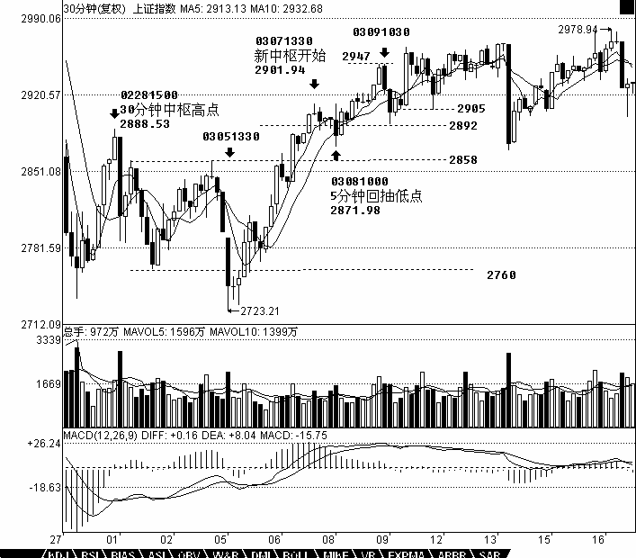

# 0478 - 教你炒股票36：走势类型连接结合性的简单运用
日期：(2007-03-13 09:00:49) 分类：[时政经济（缠中说禅经济学）] 

上堂课提到走势类型连接运算的结合性，**也就是走势类型的连接符合结合律**，即`A+B+C` = `（A+B）+C` = `A+（B+C）`，`A`、`B`、`C`的走势类型级别可以不同。因此，站在多义性的角度，根据该结合律，就不难知道，任何一段走势，都可以有很多不同的释义。必须注意，多义性不是含糊性，一个含糊的理论，其分类、概念等呈现的含糊性，只是证明该理论基础的含糊。而多义性，是站在一个严格、精确的理论基础上，用同一理论的不同视角对同一现象进行分析。

一个最简单的释义角度，就是级别，任何一段走势，都可以根据不同的级别进行分解，不妨用`An-m`的形式表示根据n级别对`A`段进行分解的第m段，就有，
`A` = `A1-1+A1-2+A1-3+…+A1-m1` = `A5-1+A5-2+A5-3+…+A5-m5` = `A30-1+A30-2+A30-3+…+A30-m30` = `A日-1+A日-2+A日-3+…+A日-m日` 等等，显然这些分解都符合本ID理论。而根据某级别进行操作，站在纯理论的角度，无非等价于选择该等式列中某个子式子进行操作，这在上一课中已经有具体说明。

还有一种应用，就是关于走势的当下判断。当下判断，其基础在于采取的分解方式。例如，一个按5分钟分解的操作角度与一个按30分钟分解的操作角度，在同一时间看到的走势意义是不同的。更重要的是，在5分钟分解中完成的走势，在30分钟却不一定完成。例如`A+B`，`A`、`B`都是5分钟的走势类型，那么`A+B`走势，对于30分钟的分解就是未完成的。根据走势必须完美的原则，未完成的走势必完成，也就是，在不同的分解角度，可以在当下看到不同级别的未完成走势根据走势必完美原则产生的运动，这方面的仔细分析留待专门的课程。

还有一种应用，就是把走势重新组合，使得走势更加清晰。很多人一看走势就晕，最主要是不了解走势连接的结合性，任何的走势，在结合律上，都可以重新组合，使得走势显示明显的规律性。假设`A+B+C+D+E+F`，`A`、`C`、`E`是5分钟级别的，`B`、`D`、`F`是30分钟级别的，其中还有延伸等复杂情况。这时候，就可以把这些走势按5分钟级别重新分解，然后按中枢的定义重新组合走势，按结合律的方法，把原来的分解变成`A'+B'+C'+D'+E'+F'`，使得`A'`、`B'`、`C'`、`D'`、`E'`都是标准的只是30分钟级别，而最后的`F'`变成在30分钟意义上未完成的走势，这样进行分析，就会很明晰了。当然，具体的组合有很多可能，如何根据当下的走势选择一种最有利指导操作的，就是考功夫的事情。

而这种根据结合律的最佳组合，是根据市场当下的走势随时变化的，而所有的变化，都符合理论要求且不会影响实际操作，是对实际操作起着更有力的帮助。例如，在最近走势中，30分钟图上，2760到2858这30分钟中枢，03081000的5分钟回抽确认了一个第三类买点，然后其后就继续走出一个新的30分钟中枢，而030810005分钟回抽低点2871点比上一中枢的最高点2888点要低，而后来关于03071330开始的这个30分钟中枢出现延伸，这样，我们就可以对这个分解进行重新组合，给出一个更清晰的组合方法，把03081000的5分钟回抽组合到03051330开始的这段5分钟走势中，形成一个5分钟的上涨，然后新的30分钟中枢就从03091030，这样的好处在于，这个中枢震荡的低点2892点比2888点高，如果其后的震荡不出现跌破2888的走势，那么就是一个30分钟的上涨走势形成了。但在这个新的中枢被一个新的第三类买点有效突破前，依然存在震荡跌破2888点甚至最终确认中枢扩展。但这样的重新组合，对看图就有了帮助。当然，站在纯中枢的角度，依然可以坚持让新中枢从03071330开始，这样对具体的操作也没有太大影响，但在判断上就没有重新组合的看起来方便了。




​    【编者注：此图可能是当时的网友补充的】


注意，这种重新组合，不涉及任何预测性，有人可能要问，那么为什么不一开始就把03081000的5分钟回抽组合到03051330开始的这段5分钟走势中？因为这种组合不利于操作，站在这种组合下，030810005分钟回抽的第三类买点意义并没有被揭示，是仅仅被局限在一个小的5分钟走势范围内，按照这种组合，就会很恐慌地等待背驰，之所以这样，是因为对走势的理解不够深刻，看不到不同组合反映的意义。而任何组合的反映都是有意义的，对这些组合意义的全面把握，就是一个工夫上的长进了。此外，组合的一个要点在于，尽量避繁就简，因为中枢扩展比较复杂，如果有组合使得不出现扩展，当然就采取该种组合更有意义。有人可能要问，那么中枢扩展的定义是否不适用？当然适用，中枢扩展的定义是在两个中枢都完全走出来的情况下定义的，而实际操作中，往往第二个中枢还没有走完，还在继续延伸中，所以，除非出现明确的、符合理论定义的破坏，就可以根据有利于判断、操作的原则，对走势进行当下的组合。但必须强调的是，当下采取什么组合，就要按该种组合的具体图形意义来判断、操作，例如，现在把03091030当成新30分钟中枢的起点，那么中枢的位置就变成2947到2905，这样后面第三类买点的位置就有了新的标准。当然，你依然可以还是按03071330开始30分钟中枢，这样，中枢的位置就是2911到2892，这样，第三类买点的可能位置就不同了。
还有一种更重要的应用，就是在中枢的震荡中。围绕中枢的震荡，不一定都是次级别的，例如，一个日线中枢，围绕他的震荡，完全可以是30分钟以下的任意级别，甚至是一个跳空缺口，例如有些股票，完全可以今天一字涨停，明天一字跌停，跳来跳去的。一般这种走势，一般人看着就晕了。但如果明白走势连接的结合性，就知道，无论怎么跳，最终都要形成更大级别的，只要不脱离这日线中枢，最后都至少会形成30分钟级别的走势。任何围绕日线级别的震荡，最终都必然可以按如下方式进行分解：`A30-1+A30-2+A30-3+…+A30-m30+a`，`a`是未完成的30分钟走势类型，至少a依然围绕日线中枢继续震荡，那a一定最终会完成30分钟的走势类型。显然，这里，m30<9，否则就会变成周的中枢了，这样整个的分解就要按日线来，而道理是一样的。

不过，更有实际意义的是，上面的`a`如果不再围绕日线震荡，例如，假设`a`是一个5分钟级别的，而其后一个5分钟级别的反抽也不回到中枢里，按照日线中枢，这并不构成第三类买卖点，但对于`A30-m30`，可能就构成30分钟的第三类买卖点。由于走势都是从未完成到完成，都是从小级别不断积累而来，因此，对于真正的日线第三类买卖点来说，这`A30-m30`的第三类买卖点，肯定在时间上要早出现，对于`A30-m30`，这绝对安全，但对日线却不一定，因为这`A30-m30`的第三类买卖点后完成的30分钟走势，可以用一个30分钟走势又重新回到日线中枢里继续中枢震荡。但这个`A30-m30`的第三类买卖点依然有参与的价值，因为如果其后的30分钟出现趋势，最后如果真出现日线的第三类买卖点，往往就在30分钟的第二个中枢附近就形成了，根本回不到这`A30-m30`的第三类买卖点位置，因此，这样的买卖点，即使不符合你的操作级别，例如，如果你是日线级别操作的，但一旦这样的A30-m30的第三类买卖出现，至少要引起你充分的重视，完全可以适量参与了，一旦其后出现趋势走势，就要严重注意了。

不应该对走势进行任何的预测，但所有已走出来的走势，却可以根据级别与结合律等随意组合，无论任何组合，在该组合下，都必然符合本ID的理论，而任何最终的走势，都在所有组合中完全符合本ID的理论，这也是本ID理论的神奇之处，无论你怎么组合，都不会出现违反本ID理论的情况。但能否找到最合适的组合以适应操作，以及根据不同的组合，对走势进行综合分析，这就和经验有关了。这些最适合的分解，都是有相应答案的，关键是你能否看出来，而这根本不涉及任何的预测，只是对已有走势的分解，与对理论的把握与图形的熟悉度相关。而这些都是一些最基本的工夫，但必须在当下的走势中不断磨练才能真正掌握。如果真能把握这些最基本的当下走势的最合理组合以及用不同组合进行综合分析，那就可以开始继续读初三了。


**本文评论获取自靠谱的方式，包含疑似禅师的回复数量：[35]**


```
UID:[1215172700] 昵称：缠中说禅 日期：(2007-03-13 09:03:17)
今天很忙，没时间上来了，课程下贴出来，各位先研究。先下，再见。
```


```
UID:[0] 昵称：[匿名] CCTV 日期：(2007-03-13 09:14:33)
顶
```


```
UID:[0] 昵称：[匿名] CCTV 日期：(2007-03-13 09:22:14)
"放宽股票的涨跌幅限制为20%，取消目前普通股票和ST股票的差异化涨跌幅限制"。而对于市场关心的未来融券具体品种上，此次作出了更为确切的论断，"在上证50ETF、上证50指数成份股、上证180指数成份股上实施融券机制，其他股票不允许融券"。与此同时，"将权证和上证50ETF作为试点交易品种，引入履行更严格报价义务的强势一级交易商"。　　
在经过了上述交易制度改革之后，"取消个股涨跌幅限制，代之以大盘断路器规则，并对权证等衍生产品不实施涨跌幅价格限制"。　　
关于市场关心的另一项内容T+0回转交易，改革排列顺序稍后，报告认为"将上证50ETF、上证50成份股作为试点交易品种，实行日内回转交易；在试点成功后，将日内回转交易推广至市场中的所有交易品种"。
```


```
UID:[0] 昵称：[匿名] CCTV 日期：(2007-03-13 09:44:04)
再次推荐000786。
```


```
UID:[0] 昵称：[匿名] CCTV 日期：(2007-03-13 09:45:32)
再次强烈推荐600980
```


```
UID:[0] 昵称：[匿名] Q 日期：(2007-03-13 10:10:38)
QIANG REN QIANG WEN
```


```
UID:[0] 昵称：[匿名] CCTV 日期：(2007-03-13 10:15:08)
000938，越来越厉害。就怪自己说了不买妹子14，只能看着不能买，晕！
```


```
UID:[0] 昵称：[匿名] CCTV 日期：(2007-03-13 10:49:10)
	[匿名] 帮帮我 2007-03-13 10:42:14 
	2007-03-13 10:22:25 
	我刚进股市,也是偶然地且很幸运地走进这里,我准备投资30万,可是一没经验,楼主的理论也没入门,可又不想失去赶趟牛车的机会，请问各位，我该如何组合投资？希望能得到一个中肯的建议. 哪位帮帮我吧
-
找机会买银行股，中行，肯定套不住。
```


```
UID:[0] 昵称：[匿名] CCTV 日期：(2007-03-13 10:51:50)
	[匿名] 小八 2007-03-13 10:17:53 
		[匿名] CCTV 2007-03-13 09:44:04 
		再次推荐000786。 　 
		
		[匿名] CCTV 2007-03-13 09:45:32 
		再次强烈推荐600980 
	－－－－－－－－－－－－－－－－－
	现在看起来不咋的呀，cctv  
-
我又不是今天才说的，600980 9元以下就说，还买了，这股票有大戏。
```


```
UID:[0] 昵称：[匿名] CCTV 日期：(2007-03-13 10:58:21)
	[匿名] 小明 2007-03-13 10:34:21 
	刚刚说了不严格的问题，缠mm就特地写了一篇文章加以解释。呵呵。我已经意识到这个问题了，我的建议是，几种级别你都试试，哪种好看就看哪个。 
-
有点自作多情，不是不严格，而是结合性，妹子说得很清楚。“必须注意，多义性不是含糊性，一个含糊的理论，其分类、概念等呈现的含糊性，只是证明该理论基础的含糊。而多义性，是站在一个严格、精确的理论基础上，用同一理论的不同视角对同一现象进行分析。”
```


```
UID:[0] 昵称：[匿名] CCTV 日期：(2007-03-13 11:29:31)
	[匿名] 春天的地铁 2007-03-13 11:25:18 
	多义性会导致歧义的产生，看来还是经验最重要。大家不妨用模拟炒股多练习练习手感。  
-
错！看看妹子怎么说：“必须注意，多义性不是含糊性，一个含糊的理论，其分类、概念等呈现的含糊性，只是证明该理论基础的含糊。而多义性，是站在一个严格、精确的理论基础上，用同一理论的不同视角对同一现象进行分析。”
```


```
UID:[0] 昵称：[匿名] 3G 日期：(2007-03-13 11:56:08)
学习`
```


```
UID:[0] 昵称：[匿名] 路过 日期：(2007-03-13 12:12:30)
	[匿名] 帮帮我 2007-03-13 10:42:14 
	2007-03-13 10:22:25 
	我刚进股市,也是偶然地且很幸运地走进这里,我准备投资30万,可是一没经验,楼主的理论也没入门,可又不想失去赶趟牛车的机会，请问各位，我该如何组合投资？希望能得到一个中肯的建议. 哪位帮帮我吧   
---------------------------------------------------------------   
有诚意加QQ297074701，有没有水平你先看效果，水平可以的话谈合作，每个月交300元就够了，现在先别骂我，看水平再说！！！
```


```
UID:[0] 昵称：[匿名] CCTV 日期：(2007-03-13 12:58:13)
	[匿名] 大盘 2007-03-13 12:50:12 
		[匿名] 袖手旁观 2007-03-13 12:33:10 
			[匿名] 大盘 2007-03-13 12:16:48 
				[匿名] 空读 2007-03-13 10:37:54 
				早,大盘中枢上沿看2911还是看2947,决定着第三类卖点到底有没有形成,对操作判断影响很大,中枢只以前三段的中间部分划分似乎太窄了,中枢扩张后中枢的范围应该随之加大了. 
			-----
			我的理解，如果你把2911作为第2个30分钟中枢高点，那么昨天下午2905的离开又返回就不构成30分钟第3买点。 
		——————————————
		2905只能算2911分法的延伸段，后面仍可以找三买 
	----------
	可是博主以前不是说过只有第一次次级别基本离开然后返回不跌破才算3买吗，不是每次离开返回不跌破都算是，所以2905虽然是算2911分法的延伸段，但是已经满足第一次离开返回跌破，因此以后的离开再返回跌破就不应该算是3买了，除非是在2947的中枢平台才有可能再出现3买。 
-
应该没有第一次的要求，只要符合次级别离开次级别回抽不碰中枢就行。如果有第一次的要求，那延伸的情况就不会有第三类买点，这显然不合理。
```


```
UID:[0] 昵称：[匿名] MM 日期：(2007-03-13 13:16:38)
请大盘同学给我看看９３８，可以出了吗？
```


```
UID:[0] 昵称：[匿名] CCTV 日期：(2007-03-13 13:37:19)
	[匿名] 袖手旁观 2007-03-13 13:27:50 
	我觉得关键是原文中强调的是第一次回抽回调，而不是第一次离开  
-
支持！
```


```
UID:[0] 昵称：[匿名] CCTV 日期：(2007-03-13 13:39:36)
000938今年怎么都上20吧。
```


```
UID:[0] 昵称：[匿名] CCTV 日期：(2007-03-13 13:57:41)
	[匿名] 傻子 2007-03-13 13:37:30 
		[匿名] 咻咻
		000786你刚好买在卖点上，强！啊，是买点吗？
	55555
	CCTV给看看阿 
-
小级别卖点，这股票以后肯定很厉害。奥运、新材料，题材太多，股价太便宜。
```


```
UID:[0] 昵称：[匿名] CCTV 日期：(2007-03-13 14:01:40)
大盘又跌破2947，所以还没戏，不能确认第三类买点。
```


```
UID:[0] 昵称：[匿名] 3G 日期：(2007-03-13 14:39:37)
938真厉害起来啦`
```


```
UID:[0] 昵称：[匿名] 3G 日期：(2007-03-13 14:46:06)
	[匿名] CCTV 2007-03-13 14:01:40 
	大盘又跌破2947，所以还没戏，不能确认第三类买点。  
-
当没跌破2911，就说明还是强势。用2911-2892中枢看，今天应该已经形成第三类买点。
```


```
UID:[0] 昵称：[匿名] CCTV 日期：(2007-03-13 14:48:05)
	[匿名] 大盘 2007-03-13 14:40:03 
	我没有统计过，不过从博主的000938来看，博主涨停股票估计博主是不会用大单去封死，真正的顺势而为，不坐庄，这估计真是博主理论的高明之处和狡猾之处吧，因此站在超短线的角度，明天高开或者冲高多半就是背离，该先出来，再找买点重新进入吧  
-
对，你看999、777，以前所有妹子说过的股票，从来没有大单封涨停，板上的单子都是慢慢堆上去，手法极为相似。
```


```
UID:[0] 昵称：[匿名] CCTV 日期：(2007-03-13 14:50:14)
	[匿名] 骑牛学妙股票 2007-03-13 14:40:48 
	各位师兄、老同学好。我是很新的新手，看了緾妹妹的理论，理解了一些，心中有个很大的问题。在走势线正在生长的时候，怎么判断是否会马上背弛？如果背驰的线长出一段时间当然可以看出来一些，但也不能判断是那个级别的背驰？对背驰的判断有没有比较容易理解的说明？谢谢！！！学习中！！  
-
这问题妹子早说过，区间套，前面课程都有。
```


```
UID:[0] 昵称：[匿名] CCTV 日期：(2007-03-13 14:50:56)
	[匿名] 3G 2007-03-13 14:46:06 
		[匿名] CCTV 2007-03-13 14:01:40 
		大盘又跌破2947，所以还没戏，不能确认第三类买点。 
	-
	当没跌破2911，就说明还是强势。用2911-2892中枢看，今天应该已经形成第三类买点。  
-
可以这样认为，今天是强势调整。
```


```
UID:[0] 昵称：[匿名] 3G 日期：(2007-03-13 14:57:52)
600635，楼主说的VC概念，好象又要来啦`
```


```
UID:[0] 昵称：[匿名] CCTV 日期：(2007-03-13 15:17:35)
妹子今天不来了，妹子是不是要上电视？
```


```
UID:[0] 昵称：[匿名] 悠悠悠哉 日期：(2007-03-13 15:20:37)
好难！！！
```


```
UID:[0] 昵称：[匿名] CCTV 日期：(2007-03-13 15:23:42)
	[匿名] 缠徒 2007-03-13 15:20:00 
	大盘和CCTV师兄,帮我分析600020的中枢好吗  
-
很好，30分钟中枢不断新生，好象日线都没形成过，超强。
```


```
UID:[0] 昵称：[匿名] CCTV 日期：(2007-03-13 15:29:23)
	[匿名] 道生一 2007-03-13 15:23:00 
	螃蟹!我喜欢,让我想起了亿安..........可这个力度不行,区间太小了吧.小小的问一下,禅女士现在没来,是不是去支持受外国封锁的企业去了,  
-
妹子最近好象忙着搞一个什么传媒去打击汉奸，具体什么没说。
```


```
UID:[0] 昵称：[匿名] 哈哈 日期：(2007-03-13 16:18:03)
理论不错。但是感觉这里有点冷！
```


```
UID:[0] 昵称：[匿名] 过客 日期：(2007-03-13 16:41:19)
	[匿名] 搬个板等坐下听 2007-03-13 16:22:47 
	当市场媒体在2月中旬盛传关于药的传闻时妹妹就说那有那么简单，起码不是那个价。今天又有“当国资委还在与华润焦头烂额讨价还价之际，德意志银行突然杀入三九集团重组之中。　　
	3月9日，业内人士 透露，五家竞购方中，德意志银行联合体提交了以40亿现金代价获得三九集团40%股权的竞购方案，而被国资 委寄予厚望的华润集团则只愿意出资39亿元，却希望获得三九集团70%的股权”这样的消息。
	妹妹太厉害了。但不明白德意志的价为什么这会儿才出？德意志是真心还是要搅局？忐忑地把药收在怀里。  
-
这还用怀疑？楼主肯定消息异常灵通，你看她说的股票，很多都有大题材，只是她知道太早，涨了很多消息才散出。
```


```
UID:[0] 昵称：[匿名] 风云 日期：(2007-03-13 16:50:28)
大盘兄,感觉600020的30分钟中枢似乎很复杂,是否由中枢扩张而来,我对中枢的判断还不很清楚,为什么有的中枢几根线就形成,比如近期上证指数30分钟的第二个中枢,能否介绍一下,如何较快速的判断一个中枢是否已形成
```


```
UID:[0] 昵称：[匿名] 过客 日期：(2007-03-13 16:54:57)
报到
```


```
UID:[0] 昵称：[匿名] 风云 日期：(2007-03-13 20:59:19)
大盘兄，感谢昨天对上证指数作出的分析，但我对第二个中枢即２０００／３后形成的感到有点不好理解，能否详细分析一下，我的困惑是２０００／９／２９处的一根Ｋ线就能代表一段次级别走势吗
```


```
UID:[0] 昵称：[匿名] TT 日期：(2007-03-13 23:19:04)
	[匿名] windowme 2007-03-13 23:04:36 
	或登录Mofile，使用提取码 8458427145338658 提取文件 大盘画缠   　 
	
	[匿名] windowme 2007-03-13 23:07:53 
	把“大盘”画的图做成了电子书。或登录Mofile，使用提取码 8458427145338658 提取文件 大盘画缠  
-
不能带地址，会被新浪删掉。
```


