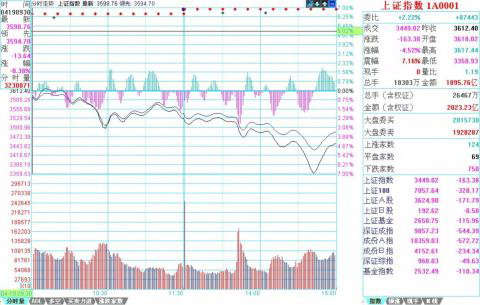
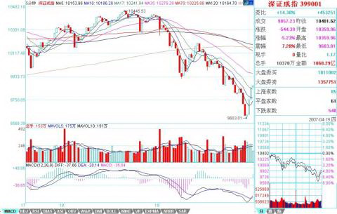

# 0511 - 教你炒股票47：一夜情行情分析
日期：(2007-04-20 08:51:58) 分类：[缠中说禅教你炒股票时政经济（缠中说禅经济学）] 



一个很显然的道理，对市场了解越多，对走势的把握越精确。例如，昨天20070419的2007年一夜情行情，跌破5日线后有一个反抽，在11点08刚好构成对前一天中枢的第三类卖点，这就是最后的、被本ID理论所保障的离开机会。那么，后面去走，就完全与本ID的理论无关了，在一个下跌里，除了最后那一个位置，所有的卖出都是对的，但这和本ID的理论无关，这类似赌博，就赌不是最后的位置。当然，赌博也是一种方法，但这种把握，不在本ID的讨论范围内。

有人可能要问，就算跌破5日线，也可能很快就拉起来，确实，存在这种可能性，但市场是否选择这种可能性，就是当下的。如果很快拉起来，那自然会有一个符合本ID理论的买点出现，这只要市场自己去选择，既然已经卖出，就耐心等待。而其中，当然与分析的精确度有关，有些人分析不到位，会回补早了，那这很正常，技术更熟练的，当然应该享受更精确的买点。但节奏是重要的，站在小级别操作的角度，就算你补早了，也比没走傻看着强。补早了，就以后多总结经验，使自己的技术精度更高。

不过，必须强调的是，上面说的，都是针对资金比较小，操作级别比较小的说的。如果是按日线级别操作，那这些震荡根本无须理会。如果真按日线操作的，就应该从1000多点一直拿到现在，因为日线级别的卖点并没有出现，等出现再说。而用周线级别操作的大资金，那就更无所谓了。此外，这里只是以指数为代表来说一种方法，个股在自己的图上是一样分析的。

其实，如果你对市场理解更多点，就知道，这一夜情走势的当天低点，其实是很容易把握的。这就和上节所说的当日走势分类有关。最后一个第三类卖点对5日线进行反抽出现在11点08。前面3个30分钟K线，没有重叠。也就是说，下面走势显然不可能出现存在两个中枢的单边走势，三大类里，第二类是不可能出现了。对于第一类，平衡市的走势，最好的情况，也只能是当日中枢在11点后那个K线范围内。至于出现第三类，也是就没中枢的走势，那意味着后面有巨大跌幅。而第三类卖点后面，至少都会出现一个次级别的跌势，也就是一个1分钟以下级别的向下走势是必须完美的。所以，站在纯理论推理的角度，可以100%确定地安排后面可能的回补，也就是，从11点08开始的向下走势至少要出现走势的完美。注意，这些分析，在1108后就马上可以给出，并不需要预测或事后编排，都是根据可以根据本ID理论严格分析出来的。

下午开盘后，到1330点，就知道，第三类可能不存在了，因为当日一个连续3个30分钟K线的重合已经出现，也就是当日的中枢出现了，也就是说，到1330分钟，市场已经自己给出了选择，市场不可能出现227那天的无中枢下跌，最多就是一个弱的平衡市，因此，1030到1330这个中枢，就是最值得关注的。用中枢震荡的观点，需要比较的就是1030前的下跌与1330点后的下跌。这时候，大盘还没有真正对该中枢破位，但已经可以100%肯定地知道一旦破位，需要去看什么来决定买卖点。用MACD辅助，显然1分钟图并不适合看，因为1030到1330分钟前，这个MACD已经有绿柱子了，这样看起来费劲，可以选择更大级别的图，5分钟的。在5分钟图上，1030前的下跌刚好构成一个绿柱子面积，而1030到1330刚好出现回拉，所以黄白线没有明显到0轴，但红柱子是有了，所以，用中枢震荡的看法，后面的下跌，出现的背驰不会是5分钟级别的，只能是5分钟以下级别的，甚至就是分笔级别的最小背驰，然后引发大幅度回拉该中枢附近。当然，如果是特小级别的背驰，并不一定有足够力度决定其一定能拉回该中枢，但由于这中枢的存在，其力度是可预期的。

上面的分析，在大盘1330没真正继续破位前，就可以100%明确地给出，里面都是纯逻辑的推理，和任何预测无关。假设你已经在1108的第三类卖点出去了，而且你又是小级别操作者，那你需要的就是回补，所以有了如上分析，你就可以耐心等待，看5分钟图去比较其力度了。而且，你应该知道，强力回拉，并不一定需要一个1分钟的背驰，在大幅度下跌后，一个分笔的背驰就足以引发盘中大幅回拉该中枢，特别，由于1030前下跌引发的反抽也是一个分笔的背驰造成，一般来说，中枢震荡都有对称性，虽然不是绝对，但已经足以让你不会忽视分笔背驰引发小级别转大级别的极大可能。（分笔背驰，一般可以用1分钟MACD柱子的长度来辅助）

在大盘进入再次下跌时，你已经有足够的准备去等待。而且，你可以很明确地知道，在跌破1030到1330的中枢后，首先会有一个小的第三类卖点，小的第三类卖点后，有两种演化的可能，一是变成一个大一点级别的盘整，一个是形成下跌，至少再有两段向下。对第一种情况，在这盘整出现后，有足够的时间去选择介入，所以不用着急。而后面市场的真实选择，现在都很清楚了，就是第二种，在一个小的第三类卖点后，再出现两波下跌。

对于一个跌破中枢的下跌来说，第三类卖点后再来两波就可以随时完美。这个完美，由于该下跌是1分钟以下级别的，因此从该下跌的细部，是找不到根据1分钟背弛去确认的买点的，只可能根据分笔背驰。而根据预先知道的中枢震荡看法，唯一需要确认的是，1330后的下跌与1030前下跌的力度比较。从5分钟MACD两柱子面积的比较可以看到，前者并不比后者的力度大，这一点，参考看深圳成指的图就更明显了（请看下图）。所以，可以断言，这1330开始的下跌，一定会有强力回拉。





实际走势，在该第二波的分笔背驰（看1分钟图1443的MACD柱子，该K线还是所谓的早晨之星）后，大盘出现大幅度回拉，这其实是理论100%保证的事情。注意，并不是下跌的分笔背驰就一定存在大幅回拉，而是这天的当日平衡市的走势类型的中枢位置与时间决定的。而且，反抽的最低位置也很清楚，就是这下跌最后一个反弹处，结果收盘也真的是在该位置，这其实也是理论所保证的。

当然，如果你懂的东西更多点，对该最后位置的确定是可以很精确的。首先，日线的布林通道中轨和20天线都在3351点，按一般的技术分析，这是一个强力支持位置，而实际低点在3358点。另外，在1分钟图上的下降通道下轨，也在该位置，几个因数相配合，该位置出现反抽就完全在把握中了。

后面的走势很简单，关键是那中枢，由于分笔背驰只保证回抽到下跌最后一个反弹处，收盘已达到，而分笔背驰并不100%支持对该中枢的完全回拉，所以理论上，依然完全存在继续跌出一个更大级别的背驰再回拉的可能，当然，也可以直接上去，这必须由市场来选择。但无论哪种情况，该中枢都是一个新的中枢形成前的判断关键。而420当天中枢的位置，就决定了今后走势可能的演化。

以上，是一个分析的范本，这些分析，都是可以当下进行的，里面不涉及任何预测，市场当下的每一步走势，都相应给出分析的选择。对本ID理论熟悉的，其实1秒就可以把当下情况分析清楚，然后采取最正确的操作。但必须强调，这只是为了说明如何去分析，并不是鼓励所有人都去弄这种超级短线。当然，如果你连这么精确的分析都能当下完成并指导自己的操作，那么那些大级别的操作，就更没问题了。如果有T+0，对于小资金来说，这些就是有绝对实战意义的事情，当然，在T+1的环境下，就算3358买的，在第二天，还有出不掉的风险。而如果是T+0，那就不存在了，因为对于超级短线来说，回拉最后反弹位置就可以出来，然后看市场下一步的选择再选择下一买点。再次强调，这只是为了说明理论，并不说都要按这么小级别去操作，只不过大级别的分析是一样的，切记。

当然，如果你对当日走势的辅助判断有更深的了解，那么用当日对冲等方法来降低成本，也是可以做到的，但这只能在下节继续了。有时间，可以去研究一下与大盘节奏不同个股的走势，感受一下大盘这外在因数对个股的影响是如何首先必须有个股的内在原因的，例如，大盘的下跌反而使得某些股票构造出第二、三类买点，而在中枢上移强力延伸的股票，甚至不搭理大盘。也可以去参考一下，那些随大盘下跌的股票，是本来就存在卖点，大盘只是加大了卖点后向买点运动的幅度，但并不会改变卖点与买点的内在逻辑结构，明白了这一点，对本ID理论的理解会更深点。

今天下午一收盘就有一个会议，收盘分析只能在晚上9点半写，抱歉。

**附录：抓紧时间写两句，今天晚上有两拨事情，9点半回不来。**

**大盘今天的走势太正常不过了，今天，几乎就是一个无中枢的上扬走势，昨天已经说了，今天只要重新站稳3520，就继续原来走势。今天前1小时就确认了这点，今天这种走势还害怕，那就是心态问题了。整天惊弓之鸟一样，怎么参与市场？**

**当然，为了让稍微中线点的人安心点，就看5周均线，这线不破，稍微中线点的人基本可以不看盘。当然短线还要去确认5日线的重新站稳，这是下周的主要任务，站不稳，还继续震荡，对于短线，只要看好5日线就可以。**

**当然，如果技术好点的，可以继续用中枢震荡的方法来看大盘走势。马上要开会了，就不多说了，请把本文好好研究一下，方法是一样的。**

**周末腐败快乐。**


**本文评论获取自靠谱的方式，包含疑似禅师的回复数量：[24]**


```
UID:[1215172700] 昵称：缠中说禅 日期：(2007-04-20 08:53:33)
今天下午一收盘就有一个会议，收盘分析只能在晚上9点半写，抱歉。先下，再见。
```


```
UID:[0] 昵称：[匿名] CCTV 日期：(2007-04-20 09:12:08)
妹子好
```


```
UID:[0] 昵称：[匿名] 3G 日期：(2007-04-20 09:16:46)
顶
```


```
UID:[0] 昵称：[匿名] CCTV 日期：(2007-04-20 09:25:14)
大盘要大幅反弹，竞价买入600832，满仓。
```


```
UID:[0] 昵称：[匿名] CCTV 日期：(2007-04-20 09:46:11)
将刚买的832抛出，17.35，4毛赚。
```


```
UID:[0] 昵称：[匿名] CCTV 日期：(2007-04-20 09:51:35)
14元买入600855。满仓
```


```
UID:[0] 昵称：[匿名] CCTV 日期：(2007-04-20 10:25:36)
就留下855和832，其他股票全部抛出，1/4钱。
```


```
UID:[0] 昵称：[匿名] CCTV 日期：(2007-04-20 11:10:30)
1/4全换成625，14.69
```


```
UID:[0] 昵称：[匿名] CCTV 日期：(2007-04-20 11:12:19)
	[匿名] 新年好 2007-04-20 11:08:20 
	好像大盘有背驰的迹象，我要先卖了，宁愿卖早了，也不要卖晚了  
-
急什么呀，看看妹子昨天怎么说的？现在站稳3520，要卖也等下午碰5日线呀。
```


```
UID:[0] 昵称：[匿名] CCTV 日期：(2007-04-20 11:24:48)
感觉5日线上不去，可以把早上买的出掉。
```


```
UID:[0] 昵称：[匿名] CCTV 日期：(2007-04-20 11:44:19)
	[匿名] 赚到了 2007-04-20 11:41:08 
		最后一个第三类卖点对5日线进行反抽出现在11点08。前面3个30分钟K线，没有重叠。也就是说，下面走势显然不可能出现存在两个中枢的单边走势，三大类里，第二类是不可能出现了。
	=============
	缠MM，有点不解，前面3个30分钟K线没有重叠也不能排除出现存在两个中枢的单边走势啊，比如接下来2、3、4构成中枢，5、6、7、8中的三个构成另一个中枢  
--
不对吧，妹子说过，两个中枢必须有一个单边区间连接，我理解就是至少要7根K线。
```


```
UID:[0] 昵称：[匿名] CCTV 日期：(2007-04-20 11:51:13)
按我的理解，如果是6、7、8构成中枢，4、5构成连续下跌，前面1、2根也是，这样第3根就是换档，这不算构成中枢。
```


```
UID:[0] 昵称：[匿名] CCTV 日期：(2007-04-20 11:53:43)
	[匿名] christine 2007-04-20 11:51:19 
		[匿名] CCTV 2007-04-20 09:51:35 
		14元买入600855。满仓 
		
		[匿名] CCTV 2007-04-20 10:25:36 
		就留下855和832，其他股票全部抛出，1/4钱。 
	--
	cctv看来是精确买卖点掌握高手。是按1分钟图操作么？  
--
这几天操作不好，以前天天换股，感觉很好，这几天拿着832，反而不好，看来要总结呀。
```


```
UID:[0] 昵称：[匿名] CCTV 日期：(2007-04-20 12:00:10)
	[匿名] christine 2007-04-20 11:56:35 
		[匿名] CCTV 2007-04-20 11:12:19 
			[匿名] 新年好 2007-04-20 11:08:20 
			好像大盘有背驰的迹象，我要先卖了，宁愿卖早了，也不要卖晚了 
		-
		急什么呀，看看妹子昨天怎么说的？现在站稳3520，要卖也等下午碰5日线呀。 
	--
	CCTV,下午若是碰5日线了就得卖，那今天缠主的课程是否告诉大家，昨天抄底的今儿找高点就得卖？ 
-
好象不是这意思吧，按妹子的说法，现在就是一个中枢震荡，今天拉回那中枢，后面就看向上离开中枢有没有力度，没有就走，有力度就留着。下午好关键呀。
```


```
UID:[0] 昵称：[匿名] CCTV 日期：(2007-04-20 13:03:51)
	[匿名] 小建议 2007-04-20 12:52:12 
	什么当下不当下的，能预测才能赚钱，不能预测就不能赚钱----先理解这句再往下看。
-
别说妹子了，我从来不预测，为什么我从319到现在120%以上的利润？我的都是现场直播的，你也来一下，否则别废话。
```


```
UID:[0] 昵称：[匿名] CCTV 日期：(2007-04-20 13:21:09)
	[匿名] 傻子 2007-04-20 13:05:39 
	CCTV、大盘，给看看，我现在有0503、0802、832、600，要出吗 
-
为什么要出呀？
```


```
UID:[0] 昵称：[匿名] CCTV 日期：(2007-04-20 13:23:12)
	[匿名] 傻子 2007-04-20 13:05:39 
	CCTV、大盘，给看看，我现在有0503、0802、832、600，要出吗 
-
为什么要出呀？
```


```
UID:[0] 昵称：[匿名] CCTV 日期：(2007-04-20 14:54:06)
	[匿名] 新年好 2007-04-20 13:57:22 
	我发现持币真的是很痛苦啊，今天上午太着急卖早了，几次都想冲动买进，最后还是控制住了。我今天一定要练习一下持币，等到买点再说。  
-
今天有什么理由走？妹子昨天提示得不够清楚吗？
```


```
UID:[0] 昵称：[匿名] CCTV 日期：(2007-04-20 14:58:12)
	[匿名] 新浪网友 2007-04-20 14:44:24 
	今天算是被涮了，一大早丢出篇文章结果空仓了一天 
--
看到妹子题目没有，什么叫一夜情，今天还跌还叫一夜情吗？蠢！看到我上面一大早就满仓没有？
```


```
UID:[1215172700] 昵称：缠中说禅 日期：(2007-04-20 15:25:57)
抓紧时间写两句，今天晚上有两拨事情，9点半回不来。 大盘今天的走势太正常不过了，今天，几乎就是一个无中枢的上扬走势，昨天已经说了，今天只要重新站稳3520，就继续原来走势。今天前1小时就确认了这点，今天这种走势还害怕，那就是心态问题了。整天惊弓之鸟一样，怎么参与市场？ 当然，为了让稍微中线点的人安心点，就看5周均线，这线不破，稍微中线点的人基本可以不看盘。当然短线还要去确认5日线的重新站稳，这是下周的主要任务，站不稳，还继续震荡，对于短线，只要看好5日线就可以。 当然，如果技术好点的，可以继续用中枢震荡的方法来看大盘走势。马上要开会了，就不多说了，请把本文好好研究一下，方法是一样的。 周末腐败快乐。先下，再见。
```


```
UID:[0] 昵称：[匿名] CCTV 日期：(2007-04-20 15:33:29)
	[匿名] 缠心雕龙 2007-04-20 15:29:49 
		[匿名] 袖手旁观 2007-04-20 15:15:50 
			[匿名] CCTV 2007-04-20 14:58:12 
				[匿名] 新浪网友 2007-04-20 14:44:24 
				今天算是被涮了，一大早丢出篇文章结果空仓了一天 
			--
			看到妹子题目没有，什么叫一夜情，今天还跌还叫一夜情吗？蠢！看到我上面一大早就满仓没有？ 
		——————————————————————
		是啊，这么明白的标题。结果是单边涨，呵呵 
	－－－－－－－－
	后面的走势很简单，关键是那中枢，由于分笔背驰只保证回抽到下跌最后一个反弹处，收盘已达到，而分笔背驰并不100%支持对该中枢的完全回拉，所以理论上，依然完全存在继续跌出一个更大级别的背驰再回拉的可能，当然，也可以直接上去，这必须由市场来选择。看上面这段，可没说今天必涨。一夜情，过夜就拜拜。  
--
说今天一定涨就成预测啦`，妹子不预测，今天大盘一开始自己就选择啦，一看就明白呀。
```


```
UID:[0] 昵称：[匿名] CCTV 日期：(2007-04-20 15:34:31)
妹子最近神出鬼没的，我也去腐败算啦`88
```


```
UID:[0] 昵称：[匿名] 3G 日期：(2007-04-20 15:38:09)
	缠中说禅 2007-04-19 15:37:29 
	今天走势很正常，技术上的道理，昨天已经说了，就算搞不清楚昨天说的，5日线下破以及04191108昨天中枢的第三类卖点，都足以让你有足够时间去反应。牛市就是快跌慢涨，卖了就要找机会买回来，否则，牛市与你无关。基本面上，数据最终如何，问题都不大，就算是加息，也没什么大不了的。今天1030到1330，三K线形成3520上下的中枢，短线就看这能否重新上穿，一旦上穿站稳，就继续原来走势。当然，站在本ID的角度，完成深圳1万，上海3500的第一目标，是希望在这里出现一个整固过程，这在前面也说过，这样才会比较稳健。当然，目前资金流入太快，本ID这类稳健的想法，不一定能得到市场的认可，本ID只看市场的反应，市场想干什么都可以。个股方面，补涨的、故意玩坏业绩的，都会继续表现。  
--
看看楼主昨天说的，太明白了。“卖了就要找机会买回来，否则，牛市与你无关。”这句可以送给空头。我发现一只股票太符合楼主说的故意玩坏业绩，600594，公布-1元业绩后天天狂涨。还有600139也是。
```


```
UID:[0] 昵称：[匿名] 过客 日期：(2007-04-21 13:37:35)
	[匿名] 晕缠 2007-04-21 13:14:03 
	lz:下午开盘后，到1330点，就知道，第三类可能不存在了，因为当日一个连续3个30分钟K线的重合已经出现，也就是当日的中枢出现了.1030，1100，1130这三根30分钟线已经重合了呀？怎么文章说1330才出现呢？哪位大侠帮助解惑，谢谢！ 
--
前面两根属于下跌，后面开始反弹形成中枢。
```


