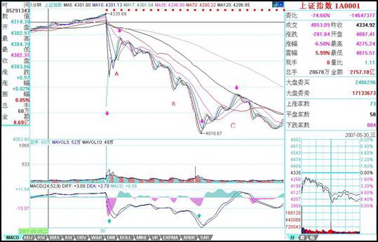

# 0541 - 教你炒股票56：530印花税当日行情图解
日期：(2007-05-30 22:49:10) 分类：[时政经济（缠中说禅经济学）] 

本来不想说股票的，但知道现在说其他，大多数人也反应迟钝，被股票所迷惑了，所以还不如将错就错，就继续股票一把，说说昨天这530印花税当日行情如何去当下地分析。

本来这个问题十分简单，而且本ID一大早7点不到就发帖子提醒要在第二、三卖点把仓位减掉，很高兴看到不少人都能发现9点48那第二类卖点。注意，为什么同时强调第三类卖点，因为有些特别弱的股票，可能就是一个第三类卖点，大盘的走势是一个平均走势，而且当天比很多个股都强，所以大盘是第二类卖点，并不意味着个股是第二类卖点。

很多人大概到现在都不明白为什么本ID的理论中要有三类卖点，其实，第二类卖点除了在小级别转大级别上比第一类卖点优越，在一些特殊的突发情况下，就是最佳的卖点。例如这次，就是一个很好的例子。因为529那天，虽然30分钟明显进入背驰段，但由于当天尾盘是高收的，所以用区间套定理并不能确认当时就是背驰了，毕竟还有第二天的走势。而晚上的突发消息，使得这个背驰被立刻确认，这时候，第一类卖点已经不可能在实际操作中存在，那么，唯一可以进行操作的，只能是第二或第三类卖点。这，在开盘前就可以有一个确定，也就是说，一旦大幅度低开，现实的、能被理论完全保证的卖点就是第二类或第三类卖点。





上图就是昨天走势的1分钟图。缺口，被看成最低级别的，而1分钟以下级别，在1分钟图上，被看成没有内部结构的线段，所以缺口和1分钟以下级别在1分钟图上是同级别的。图上绿尖头都指着两个1分钟以下级别的分界点，两相邻绿箭头之间都是1分钟以下级别的走势类型。其中B段，看似要形成3个1分钟的中枢，但由于每一个的第三段其实都是向下倾斜下去的，其实都是第二段向下的一部分，不能算是形成中枢。昨天走势其实就这么简单，就是5个1分钟以下走势类型的组合。

显然，这第一段的1分钟以下级别走势类型是以向下缺口的形成构成的，根据第二类卖点的定义，就知道，一旦一个1分钟以下级别的向上过程不能创新高或背驰，都将构成第二类卖点。因此，当图中A段走势出现时，一个构成第二类卖点的走势就当下地形成中。

有人可能有疑问，那怎么知道这A段一定构成第二类卖点而不是直接创新高强烈上升，这很简单，具体的方法和区间套定理是一样的，就是看A段的内部结构，一旦内部出现背驰而当时位置没创新高或与前面走势产生盘整顶背驰，那么就一定是第二类卖点。在昨天的具体走势中，A段在内部出现上下上的内部结构时，其中的第二段向上明显出现背驰走势，这可以成交量，或从第一个红箭头所指的MACD绿柱子与后面红柱子绝对值大小比较辅助判断。因此，这个第二类卖点，可以用理论完全明确地确认，一点含糊的地方都不会有。如果当时当下不能明白，那就要抓紧学习了，因为这个问题确实太简单了。

第二类卖点后，从第二绿箭头开始的B段走势，其力度就要和缺口那一段来对比，比较MACD上两个红箭头指的绿柱子面积，注意，第二个要把前面的三个小绿柱子面积也加上，可以看出，即使这个，后者的力度也不大过前者，由此就知道，B段构成了盘整背驰，也就是后面的反弹一定回到第一个绿箭头位置之上。（注意，这里是1分钟以下级别的力度对比，只需要比较柱子面积，如果是1分钟级别的，就要同时考虑黄白线回抽0轴的情况。）而后面C段的走势也证明了这一点。此外，C段的高点，用C段下方对应的MACD柱子高度对比不难用背驰的方法判断。由此，ABC三段就有了重叠，因此就构成了一个1分钟的中枢，区间在4087到4122点。这就成了直到后面、包括明天走势的最关键地方，究竟是中枢震荡，还是形成第三类买卖点，进而构成更大中枢或趋势，都以此为基准。而这是被理论所当下严格保证，毫无可以含糊的地方。

有些更细致的地方，其实还可以说的。例如，C段的高点，没有重回B段内部最后一个反弹的启始位置，这并不违反理论，因为在B段内部，最后一段向下并没有背驰，他的转折，完全是小级别转大级别造成的（由于级别太小，可以从柱子的缩短参考看出），这自然就不一定能回到最后一个反弹的启始位置。而在B段内部，从绿柱子一个比一个面积大，就知道前面的向下都不会形成背驰而使B段结束，因此就可以当下地等待最后跌破A段低点，形成B段与缺口段的盘整背驰。这个例子说明，一个大的盘整背驰段的内部结构，完全可以不必有该级别的背驰，完全可以小级别转大级别，昨天的图上就有这样一个标准的例子。

实际操作中，第二类卖点后，B段盘整背驰造成的买点是否要参与回补，这和你的操作级别有关，如果是股指期货，这对应的是100点的空间，当然是可以参与的，但由于T+0，而且现在交易成本提高了，对于股票是否参与，这就与你实际操作的股票有关了，这必须根据自己的情况灵活处理。但只要你明白了小级别的情况，大级别的操作是一样的，而且大级别的安全性、可操作性更高，操作的频率也更低而已。本ID说这里的例子，只是让大家对理论能更清楚地了解。


**附录：**

**明白了上面的文章，今天的走势如果都不能把握，那就要继续加班学习了。昨天4087-4122的中枢，今天一大早的上冲没有触及4087点，所以就构成了该中枢的第三类卖点。后面三波的下跌，与昨天的B段比，明显背驰，其内部，最后一波，在1分钟图上，绿柱子明显缩短，所以内部也背驰，根据区间套就可以当下定位10点02分低点。这是本ID理论中最简单的技术的，如果今天没能这样的分析的，请好好研究补习。**

**后面的反弹，如本ID所指出的，第三卖点后不趋势就构成更大中枢，所以现在原来的1分钟中枢已经扩张到5分钟中枢。区间是4015点到4122点，后面就是该中枢的震荡直到第三类买卖点出现。就这么简单，一点难度都没有。**

**大方面看，本ID反复强调的1/2线，依然是最重要的位置，大盘的强弱，以此为标准。目前，该线刚好在这次大震荡的中间位置上，由此就知道该线的意义有多大。在5月初的文章里已经明确说过，该线至少要管大盘3个月，这观点不变。**

**今天的月线收盘，已经足够好了，至少上影线不太长，比最恶劣的倒T要好多了，因此下月，至少有了很大的画图回旋的余地。注意，最近的行情，又将以质优的一、二成分股为主，三线股一定要等到大盘基本稳定下来，才会慢慢恢复元气。但明天和周一，今天反弹比较弱的，会逐步表现，这和轮动是一个道理。**

**明天是周五，消息面又成了最大的心理压力，整个市场震荡要稳定下来，要等到下周了。当然，这种大幅震荡，就是本ID理论的天堂，在这里可以得到比单边更大的利润。注意，别以为本ID的理论只会震荡，而是该震荡的时候震荡，该单边的时候单边，这都不明白，就白学了。**


**本文评论获取自靠谱的方式，包含疑似禅师的回复数量：[54]**


```
UID:[1215172700] 昵称：缠中说禅 日期：(2007-05-30 22:53:01)
晚上10点回来，抓紧把帖子写了，让大家有更多时间看课程，早点帖出来，明早就不贴了。子时，下，解盘在明天收盘附录帖子后，再见。
```


```
UID:[1215172700] 昵称：缠中说禅 日期：(2007-05-30 22:54:41)
补充一句，图片看不到的，请到本ID的相册里，第四张就是。
```


```
UID:[0] 昵称：[匿名] TT 日期：(2007-05-30 23:07:32)
	买点 2007-05-30 23:04:17 
	八卦一下，老大好像用的也是同花顺。  
-
楼主好象说过，她只会用同花顺截图。
```


```
UID:[0] 昵称：[匿名] 哈哈 日期：(2007-05-30 23:13:06)
可爱女人啊~图真小~
```


```
UID:[0] 昵称：[匿名] 路过 日期：(2007-05-31 06:56:40)
关注如下板块突发转变.重大利空：猪肉板块重大利空！由于今天股民大幅割肉，故肉食供应大大增加，猪肉价 格将大大下降，猪肉将拖累整个农业板块！紧急关注钢铁板块：大批股民上街买菜刀，准备到血拼，市场上菜 刀已被抢购一空，钢铁供不应求，预计整个钢铁板块将强势上攻，再创新高！特别关注农药板块和木材板块，因为大批股民喝农药，并在其后开  

这年头,国家骗国家是外交,国家骗老百姓是政策,百姓骗国家是犯罪,百姓骗百姓是生意,父母骗孩子是教育, 男女互骗是爱情. [原帖] 　新浪网友 IP:219.138.131.*
```


```
UID:[0] 昵称：[匿名] 3G 日期：(2007-05-31 09:00:10)
	[匿名] 悟性不好吃大亏！ 2007-05-31 08:47:44 
	本人悟性不好，一个印花税的特大利空，一只股票都没走成，利润缩水，不知合适的卖点！有一支股有10送5加派红利1.7，第ｘ类卖点走合适！谢谢缠师指点！  
、、
有送股的股票不用卖吧，楼主昨天不是说了，大盘一稳定，个股就有机会吗？
```


```
UID:[0] 昵称：[匿名] 3G 日期：(2007-05-31 09:01:45)
	[匿名] 兰兰 2007-05-31 08:56:52 
	姐姐早!大家早!姐姐分析得好!就是不太明白跌破A段低点，B段与缺口段的盘整背驰如何判断?  
、、、
绿柱子面积对比，不过楼主的MACD参数和一般的不同，不知道有什么需要调整的地方。
```


```
UID:[0] 昵称：[匿名] CCTV 日期：(2007-05-31 10:06:42)
注意背驰！！！！我早上先卖一半，现在回补1/4！！！
```


```
UID:[0] 昵称：[匿名] CCTV 日期：(2007-05-31 10:07:56)
KAO，全满！！！不怕！！！
```


```
UID:[0] 昵称：[匿名] CCTV 日期：(2007-05-31 10:30:12)
怕了鸟，我今天的策略是，先卖了一半，刚才全回补，等一下上去抛另一半，有钱有货怕个鸟！！！
```


```
UID:[0] 昵称：[匿名] CCTV 日期：(2007-05-31 10:35:19)
	[匿名] CCTV 2007-05-31 10:06:42 
	注意背驰！！！！我早上先卖一半，现在回补1/4！！！   
	
	[匿名] CCTV 2007-05-31 10:07:56 KAO，全满！！！不怕！！！  
	
---
那些SB！！！你看大爷现场直播，现在看怎么样？？？？KAO，下跌这么多，大爷把成本降了2元，！！！现在832的总成本已经15元多点了！！！！！我一定要降到0！！！！！
```


```
UID:[0] 昵称：[匿名] CCTV 日期：(2007-05-31 10:45:08)
抛了1/4，下来再买！！！我现在已经可以不把股票当股票啦！！！！妹子说得好！！就是筹码！！就是废纸！！！
```


```
UID:[0] 昵称：[匿名] CCTV 日期：(2007-05-31 10:51:46)
	[匿名] 别问我是谁 2007-05-31 10:37:29 
		[匿名] 新浪网友 2007-05-31 04:18:56 
		天要亮了，我要睡了，睡个安稳觉，因为我空仓了，割肉空的仓库5555555。虽然学了几个月所谓中枢，但我昨天上午出场时并没有用到所谓中枢买卖法，所幸，我凭感觉卖在了高点。说实话，这几个月我唯尔是瞻，坠入云雾般的所谓中枢买卖法中打短差，却一次次踏空主升段，我的资产收益率低得可怜，我不仅没赚到钱，还广受当初劝我别迷信你的人的耻笑。88。 
	=================
	我的经历和你相似 茫茫然  
	
--
谁告诉你妹子的中枢就是打短差？？？？中枢移动的时候为什么打短差？？？？自己没学懂还胡说？？？？？
```


```
UID:[0] 昵称：[匿名] CCTV 日期：(2007-05-31 10:52:33)
	[匿名] 新浪网友 2007-05-31 10:45:47 
	CCTV向你学习.我也补了139等比的地板价.为中国股市走向真正的健康,成熟,加油!!!  
--
不要补ST，每天才跌5%，要补连跌20%以上的！！！！
```


```
UID:[0] 昵称：[匿名] XX 日期：(2007-05-31 10:55:20)
找死呀！还进等比
```


```
UID:[0] 昵称：[匿名] CCTV 日期：(2007-05-31 11:10:44)
再次满仓等冲红盘！！！！
```


```
UID:[0] 昵称：[匿名] CCTV 日期：(2007-05-31 11:11:59)
	[匿名] 操N妈 2007-05-31 11:09:11 
	CCTV你妈生你的时候肯定那太紧把你脑袋夹了所以才让变成这样，真不容易啊一个脑瘫人士也活到现在了  
--
看到大爷今天准确判断背驰你不舒服了吗？？？？大SB！！！！！
```


```
UID:[0] 昵称：[匿名] CCTV 日期：(2007-05-31 11:12:56)
	[匿名] 股痴 2007-05-31 11:11:18 
	抢盘开始.有钱的朋友赶快抢.  
--
现在晚不晚？？看到大爷在10点0几分的留言没有？？？知道妹子理论的威力没有？？？？？
```


```
UID:[0] 昵称：[匿名] CCTV 日期：(2007-05-31 11:27:44)
NND，股指期货怎么还不出来？？？大爷看指数现在简直太准啦！！！刚才又是150点以上呀！！！哭！！！
```


```
UID:[0] 昵称：[匿名] CCTV 日期：(2007-05-31 11:32:26)
	[匿名] 新浪网友 2007-05-31 11:30:20 
		[匿名] CCTV 2007-05-31 11:27:44 
		NND，股指期货怎么还不出来？？？大爷看指数现在简直太准啦！！！刚才又是150点以上呀！！！哭！！！ 
	==
	CCTV,为什么哭呀? 
--
你说现在有指数期货，我刚才的判断要赚多少钱呀？？？？？？？？？？？你说哭不哭呀？？？？？？
```


```
UID:[0] 昵称：[匿名] CCTV 日期：(2007-05-31 11:38:17)
上面说没看到大爷直播的，看这里！！！！！！

	[匿名] CCTV 2007-05-31 10:35:19 
	[匿名] CCTV 2007-05-31 10:06:42 
	注意背驰！！！！我早上先卖一半，现在回补1/4！！！ 
	
	[匿名] CCTV 2007-05-31 10:07:56 
	KAO，全满！！！不怕！！！ 
	
---
那些SB！！！你看大爷现场直播，现在看怎么样？？？？KAO，下跌这么多，大爷把成本降了2元，！！！现在832的总成本已经15元多点了！！！！！我一定要降到0！！！！！
```


```
UID:[0] 昵称：[匿名] CCTV 日期：(2007-05-31 11:39:54)
注意！！！我是把22元买的832现在已经降到成本15元多！！！！！你说大爷怕什么？？？？？？？
```


```
UID:[0] 昵称：[匿名] XX 日期：(2007-05-31 11:40:56)
	惊鸿 2007-05-31 11:35:01 
	今天上午多空对决很精彩！！关键时刻上海机场顶得住，中国国贸平安人寿冲得上！中国石化、工行、中行稳得住！尤其是深圳，顶住巨大的背驰压力翻红了！应该授予特级超级军功章！  
	
看别人的，多学学。
```


```
UID:[0] 昵称：[匿名] CCTV 日期：(2007-05-31 11:41:42)
大爷现在就把832当股指期货来练习！！！！就玩一只股票！！！！！！！怎么啦！！！！！
```


```
UID:[0] 昵称：[匿名] CCTV 日期：(2007-05-31 11:44:29)
	[匿名] XX 2007-05-31 11:40:56 
		惊鸿 2007-05-31 11:35:01 
		今天上午多空对决很精彩！！关键时刻上海机场顶得住，中国国贸平安人寿冲得上！中国石化、工行、中行稳得住！尤其是深圳，顶住巨大的背驰压力翻红了！应该授予特级超级军功章！ 
		
	看别人的，多学学。  
	
--
SB呀！！！底背驰是向上的！！顶个鸟压力！！！懂不懂什么是背驰！！！！对你们这群SB不能客气！！！！大爷本来不想和你们计较，有本事就现场直播！！！大爷10点几分现场提醒背驰到底！！！全仓！！！！没这本事别在大爷面前说话！！！！！！
```


```
UID:[0] 昵称：[匿名] XX 日期：(2007-05-31 11:59:16)
        [匿名] XX 2007-05-31 11:40:56 
            惊鸿 2007-05-31 11:35:01 
            今天上午多空对决很精彩！！关键时刻上海机场顶得住，中国国贸平安人寿冲得上！中国石化、工行、中行稳得住！尤其是深圳，顶住巨大的背驰压力翻红了！应该授予特级超级军功章！ 

        看别人的，多学学。 
    --
    SB呀！！！底背驰是向上的！！顶个鸟压力！！！懂不懂什么是背驰！！！！对你们这群SB不能客气！！！！大爷本来不想和你们计较，有本事就现场直播！！！大爷10点几分现场提醒背驰到底！！！全仓！！！！没这本事别在大爷面前说话！！！！！！  

好好说话不到吗？大你M的B，要老子骂你呀！！！生你个没教养的杂种！！！！
```


```
UID:[0] 昵称：[匿名] XX 日期：(2007-05-31 12:10:03)
	[匿名] CCTV 2007-05-31 11:40:56 
			惊鸿 2007-05-31 11:35:01 
			今天上午多空对决很精彩！！顶住巨大的背驰压力翻红了！应该授予特级超级军功章！ 
		
		看别人的，多学学。  
		
	SB呀！！！底背驰是向上的！！顶个鸟压力！！！懂不懂什么是背驰！！！！对你们这群SB不能客气！！！！大爷本来不想和你们计较，有本事就现场直播！！！大爷10点几分现场提醒背驰到底！！！全仓！！！！没这本事别在大爷面前说话！！！！！！      
	
你什么了不起的，你大爷我28就清仓了，还有人等比等比的，没看出头部吗？    
你们就乞求LZ让你们有逃命的机会吧！！哈哈
```


```
UID:[0] 昵称：[匿名] CCTV 日期：(2007-05-31 12:18:24)
	[匿名] XX 2007-05-31 12:10:03 
		[匿名] CCTV 2007-05-31 11:40:56 
				惊鸿 2007-05-31 11:35:01 
				今天上午多空对决很精彩！！顶住巨大的背驰压力翻红了！应该授予特级超级军功章！ 
				
			看别人的，多学学。 
			
		SB呀！！！底背驰是向上的！！顶个鸟压力！！！懂不懂什么是背驰！！！！对你们这群SB不能客气！！！！大爷本来不想和你们计较，有本事就现场直播！！！大爷10点几分现场提醒背驰到底！！！全仓！！！！没这本事别在大爷面前说话！！！！！！ 
		
	你什么了不起的，你大爷我28就清仓了，还有人等比等比的，没看出头部吗？ 
	你们就乞求LZ让你们有逃命的机会吧！！哈哈   
	
--
你SB呀！！！大爷什么时候买过139？？？妹子当天就一大早上来说不要买小盘股！！！139这么明显的顶背驰还看不到？？？？但我也没买妹子让买的600569！！！！我为什么要买？？？大爷只有832！！！你SB清仓就把当时的直播转过来！！！像大爷刚才10点一样！！！现在事后说算个鸟！！！死----
```


```
UID:[0] 昵称：[匿名] CCTV 日期：(2007-05-31 12:35:43)
	[匿名] 新浪网友 2007-05-31 12:22:59 
		[匿名] 明珠 2007-05-31 11:58:14 
		下午估计还要往下走!!大家还是小 
	=====
	CCTV,他讲的不会是真的吧!!!! 
	
		[匿名] 明珠 2007-05-31 11:58:14 
		下午估计还要往下走!!大家还是小 
	=====CCTV,他讲的不会是真的吧!!!!  
	
--
不要预测！！！看图操作！！！妹子怎么告诉你的呀！！！下午如果有顶背驰，大爷就把剩下的1/4832仍出去，尾盘再拿出来！！！！大爷就是天天满仓，怎么啦！！！！
```


```
UID:[0] 昵称：[匿名] XX 日期：(2007-05-31 13:22:53)
	比特小天使 2007-05-31 13:14:36 
	请心情不好的新同学不要再攻击CCTV同学了，心情不好就请从身边的人那里多看，多想别人的比自己的地方。骂人是不可能让自己赚钱的。  
	
不是心情不好，我早就了结了股票。没有做得不好的，看不过SB在这狂，你比LZ还行呀？人还是要有爱心的吗？别太狂！！！
```


```
UID:[0] 昵称：[匿名] CCTV 日期：(2007-05-31 13:32:09)
妹子要给我带大红花！！！！！！！
```


```
UID:[0] 昵称：[匿名] 哈哈 日期：(2007-05-31 13:42:49)
大家注意BBA50
```


```
UID:[0] 昵称：[匿名] CCTV 日期：(2007-05-31 14:39:30)
反正大爷以后不说了，那些SB看了我的提示还骂大爷！！！大爷自己玩得开心！！！懒得理大SB！！！！！！
```


```
UID:[0] 昵称：[匿名] CCTV 日期：(2007-05-31 15:14:06)
	[匿名] 新浪网友 2007-05-31 14:57:20 
	有个DB早上出掉说下午接货的哈哈笑死我了，SB的CCTV踩空了吧，你不说话太好了这里终于清静了~谢谢谢谢你快滚吧  
--
你SB！！！大爷10点多抄了底，踩什么空？？？？20块把最后的1/4832扔，收盘回补，等于全仓换了一次，你有这本事吗？？？？大SB！！！！
```


```
UID:[1215172700] 昵称：缠中说禅 日期：(2007-05-31 15:43:16)
明白了上面的文章，今天的走势如果都不能把握，那就要继续加班学习了。昨天4087-4122的中枢，今天一大早的上冲没有触及4087点，所以就构成了该中枢的第三类卖点。后面三波的下跌，与昨天的B段比，明显背驰，其内部，最后一波，在1分钟图上，绿柱子明显缩短，所以内部也背驰，根据区间套就可以当下定位10点02分低点。这是本ID理论中最简单的技术的，如果今天没能这样的分析的，请好好研究补习。后面的反弹，如本ID所指出的，第三卖点后不趋势就构成更大中枢，所以现在原来的1分钟中枢已经扩张到5分钟中枢。区间是4015点到4122点，后面就是该中枢的震荡直到第三类买卖点出现。就这么简单，一点难度都没有。大方面看，本ID反复强调的1/2线，依然是最重要的位置，大盘的强弱，以此为标准。目前，该线刚好在这次大震荡的中间位置上，由此就知道该线的意义有多大。在5月初的文章里已经明确说过，该线至少要管大盘3个月，这观点不变。今天的月线收盘，已经足够好了，至少上影线不太长，比最恶劣的倒T要好多了，因此下月，至少有了很大的画图回旋的余地。注意，最近的行情，又将以质优的一、二成分股为主，三线股一定要等到大盘基本稳定下来，才会慢慢恢复元气。但明天和周一，今天反弹比较弱的，会逐步表现，这和轮动是一个道理。明天是周五，消息面又成了最大的心理压力，整个市场震荡要稳定下来，要等到下周了。当然，这种大幅震荡，就是本ID理论的天堂，在这里可以得到比单边更大的利润。注意，别以为本ID的理论只会震荡，而是该震荡的时候震荡，该单边的时候单边，这都不明白，就白学了。
```


```
UID:[0] 昵称：[匿名] CCTV 日期：(2007-05-31 15:52:30)
	[匿名] 新浪网友 2007-05-31 15:20:26 
		[匿名] CCTV 2007-05-31 10:45:08 
		抛了1/4，下来再买！！！我现在已经可以不把股票当股票啦！！！！妹子说得好！！就是筹码！！就是废纸！！！
		
		[匿名] CCTV 2007-05-31 11:10:44 
		再次满仓等冲红盘！！！！
		
	=============================
	有脑子的自己看时间，然后再看看832今天分别在他说的时间都是什么价格，10点45 18块8抛的 
	11点10分18块9毛多接回来，真TM傻，这里会看背驰的都能比他做的好，SB一个还直播，丢人现眼等CCTV如何回应  
	
--
你傻B呀，大爷操作完再上来，没有时间差？？？？大爷那次是19.18抛的，18.91买回来怎么不可以？？？大爷早上就说还有1/4下午背驰抛，收盘买回来，大爷下午就这样操作！！！背驰的时候就不直播了！！！怎么了？？？告诉你们，像今天早上10点几分通知大家背驰的事，大爷以后不干了，亏死你们这些大SB！！！！！
```


```
UID:[1215172700] 昵称：缠中说禅 日期：(2007-05-31 15:58:38)
	[匿名] 美女  2007-05-31 15:56:46 
		昨天4087-4122的中枢，今天一大早的上冲没有触及4087点，所以就构成了该中枢的第三类卖点。后面三波的下跌，与昨天的B段比，明显背驰，其内部，最后一波，在1分钟图上，绿柱子明显缩短，所以内部也背驰，根据区间套就可以当下定位10点02分低点。这是本ID理论中最简单的技术的，如果今天没能这样的分析的，请好好研究补习。
	==============
	“后面三波的下跌，与昨天的B段比，明显背驰” 这个怎么看出来的啊？ 我用1F图分析MACD绿柱子块没有减小啊， 背驰判断还有什么诀窍？ 
	
==
你要把所有面积加起来比较，这是最基本的知识。请把相应课程要复习一下。
```


```
UID:[0] 昵称：[匿名] 张三 日期：(2007-05-31 15:59:21)
期待缠mm的打坐2啊
```


```
UID:[1215172700] 昵称：缠中说禅 日期：(2007-05-31 16:00:35)
	[匿名] 竹子  2007-05-31 15:56:56 
	缠mm,你好！请问s和st股接下去会有表现吗？我是重仓，本来打算至少中线的，可是这两天每天跌停，转眼利润大幅减少，不知该怎么办了。谢谢！  
==
这些股票两个跌停也就别人的一个，大多数都回来20%以上了，他们如果才回10%，当然没有反弹动力，这是一个常识问题。等有反弹空间，自然就反弹。
```


```
UID:[1215172700] 昵称：缠中说禅 日期：(2007-05-31 16:03:22)
	[匿名] 新浪网友  2007-05-31 15:49:44 
	楼主辛苦了，没有什么势力威胁你吧！注意身体 
==
谢谢，这倒不至于，本ID又不是豆腐做的。
```


```
UID:[1215172700] 昵称：缠中说禅 日期：(2007-05-31 16:14:00)
	[匿名] asd  2007-05-31 15:46:49 
	请禅主解答：
	1、连跳空缺口都是1分钟以下级别的走势类型，为什么A段内部上、下、上这三段不是1分钟级别以下的走势类型，而非得A段是1分钟以下级别走势类型？
	在“一个具体走势的分析”中，每一有明显高低点的上或下段（除d7g7外，而d7g7更是1分钟级别的）可都是1分钟以下级别的呀！

	2、“C段的高点，用C段下方对应的MACD柱子高度对比不难用背驰的方法判断。”该如何具体判断？ 
	
==
如何判断，你看图就知道，一高一矮，这有什么可说的。1分钟以下级别，是把下面所有级别当成线段，是没内部结构的，当然，你换了一种标准，下面可能还有无数级别。至于每个图，等于用不同度数的显微镜，关键是每张图上的标准是统一的。这标准的底线就是，先确认一个最低级别的，然后把下面的都看成线段。这问题课程里反复说过了。例如，把两张不同的图并在一起，可能看的标准就有改变，例如，可能就用5分钟的标准看，那么需要忽略的东西就不同了，这道理很简单。如果还想不明白，那就用肉眼来比喻，像看一本书，我们的级别最多就到字，但实际字里面还有无数级别，一直到电子下面还有，那这个字里的下级别，与一个电子，在肉眼看来，都是字以下级别的，根本就没区别，都看不到。
```


```
UID:[0] 昵称：[匿名] GG 日期：(2007-05-31 16:16:26)
LZ好!请问600456未来走势如何?我可是重仓呀!请百忙中回答,叩谢!!!
```


```
UID:[1215172700] 昵称：缠中说禅 日期：(2007-05-31 16:17:53)
	[匿名] hunter  2007-05-31 16:05:33 
	老大，为什么中枢不是4027-4077啊？  
==
先把中枢的三段搞清楚，提示一下，昨天的C段是这种分解的新中枢的第一段。当然，可以按照另一种分解去定中枢的位置，那么谈论就要按那种分解说了，这样，本ID的讲解就太长了。关于这问题，本ID不是已经专门示范过？请参考课程。
```


```
UID:[1215172700] 昵称：缠中说禅 日期：(2007-05-31 16:22:13)
	[匿名] 果  2007-05-31 16:12:25 
	缠姐，现在有没有必要将三线股和ST股换成蓝筹股？  
==
操作不是这样的，最正确的，就是昨天第三卖点清仓，然后回头打一、二线股，这叫节奏。现在那些股票都涨起来，你杀三线去买一线，那就左右挨嘴巴。操作，说白了就是一个节奏问题，如果节奏不对，宁愿原地踏步，把节奏调过来。
```


```
UID:[0] 昵称：[匿名] 哈哈 日期：(2007-05-31 16:27:15)
缠主，俺现在只能看看单一的中枢一到扩展就不行了，请问哪课比较能看懂中枢的扩展》》》》？？
```


```
UID:[0] 昵称：[匿名] 悠悠悠哉 日期：(2007-05-31 16:28:20)
老大 我胆怎么这么小啊
```


```
UID:[0] 昵称：[匿名] 悠悠悠哉 日期：(2007-05-31 16:32:01)
老大漂亮的老大啊 问个问题  利得税和你说的那个指引被出的概率有多大啊？？？会不会在周末再出些利空？？？
```


```
UID:[1215172700] 昵称：缠中说禅 日期：(2007-05-31 16:32:58)
	[匿名] 大盘  2007-05-31 16:21:36 
	[匿名] 大盘 2007-05-31 16:02:49 
	请问博主：从1分钟到周线，能不能给我们介绍一下各级别盘整走势和趋势走势通常需要的最小时间，这对我们散户看盘时间和波段操作节奏的掌握应该有帮助的，自己总结的总是不够放心，因为参考的例子太少 
==
看MACD从顶到底背弛需要的最短时间，任何一个级别，怎么都需要几十根K线吧，这是一个可以去统计的东西。其实，看图要当下如同看一植物在生长，太多概念没什么用。
```


```
UID:[1215172700] 昵称：缠中说禅 日期：(2007-05-31 16:35:14)
	[匿名] 鸢鸢  2007-05-31 16:30:25 
		缠中说禅 2007-05-31 16:22:13 
			[匿名] 果 2007-05-31 16:12:25 
			缠姐，现在有没有必要将三线股和ST股换成蓝筹股？ 
		==
		操作不是这样的，最正确的，就是昨天第三卖点清仓，然后回头打一、二线股，这叫节奏。现在那些股票都涨起来，你杀三线去买一线，那就左右挨嘴巴。操作，说白了就是一个节奏问题，如果节奏不对，宁愿原地踏步，把节奏调过来。 
		
	===========
	姐姐的意思是说既然没有踏准节奏就不要追高换股了,应该利用手里的股做短差降低成本,对吗  
==
板块是轮动的，最好的节奏当然是从这跳到那，每次都准点，但如果开始没这技术，先玩好一个，技术好了再来高难度的，那是目标。
```


```
UID:[0] 昵称：[匿名] 哈哈 日期：(2007-05-31 16:41:18)
	[匿名] 哈哈 2007-05-31 16:27:15 
	缠主，俺现在只能看看单一的中枢一到扩展就不行了，请问哪课比较能看懂中枢的扩展》》》》？？
```


```
UID:[1215172700] 昵称：缠中说禅 日期：(2007-05-31 16:43:34)
	[匿名] 小明  2007-05-31 16:28:24 
	老大，抚顺那钢铁是你的吧，怎么没有跟上大盘呢，更不要说钢铁板块的走势了？  
	
==
本ID什么时候说过这股票？本ID说的那股票现在关起来了，这里的人都应该很清楚。另外说一句，那什么等比，本ID当天早上专门上来说不要买小盘的，那会把盘面搞乱，那天刚好是关起来那只的最后一天，那天买关起来的，现在能有什么事？小盘那只，后面还创过一次新高，这么明显的背驰，如果当时买了，为什么不走？小盘那股票，中线当然没问题，但如果一大堆人抢了，那就有问题了。那时候，铜矿装不装就两说了。这股票其实就这么简单，如果铜矿如期装，那就一飞冲天，如果乱抢，那就趴着，等都熬不住再说。注意，那可是3000来万的盘子，装不了许多人，这就知道为什么本ID那天专门上来警告不要乱买小盘的。记得600777在1月时候为什么想死了一样，就是因为有4拨人，这当时本ID也说过的，为什么416猛，就是因为干净，就这么简单，没什么可说的。
```


```
UID:[1215172700] 昵称：缠中说禅 日期：(2007-05-31 16:45:31)
对不起，这几天聚会特别多，统一思想，才有战斗力，本ID要去聚会去了。先下，明早见。
```


```
UID:[0] 昵称：[匿名] GG 日期：(2007-05-31 20:14:49)
	[匿名] 小明 2007-05-31 16:21:28 
		[匿名] GG 2007-05-31 16:16:26 
		LZ好!请问600456未来走势如何?我可是重仓呀!请百忙中回答,叩谢!!! 
	－－－－－－－－－－－－－－
	我早就听说 456的庄家做梦都想把货搞出去，你说这样的股能涨吗？赶紧弃暗投明吧 
===========
谢谢小明！你说的是真的吗？ 我可是近42元的成本呀，而且几乎是满仓！亲爱的 美女 缠妹，我还在努力学习中，还无法用你的 理论去实际操作，那我该如何操作呢？？？ 希望今后不会在如此愚蠢了。 盼给予提示，谢谢！！！！！
```


```
UID:[0] 昵称：[匿名] XX 日期：(2007-05-31 21:06:37)
呵！说了等比=等死吧！不要跟风的。
```


